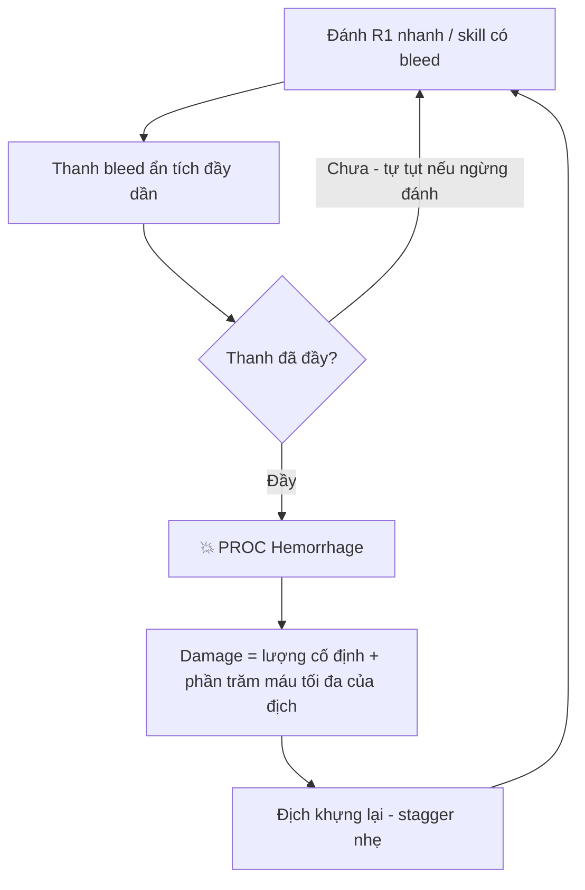
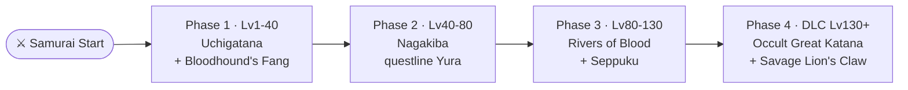
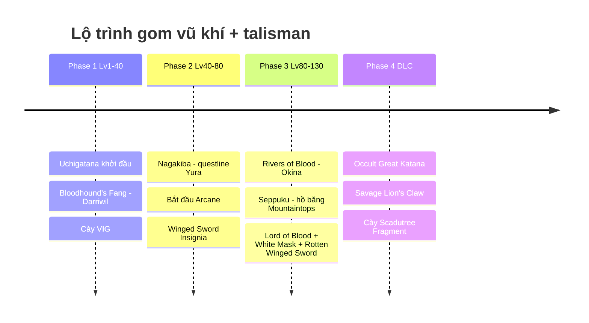
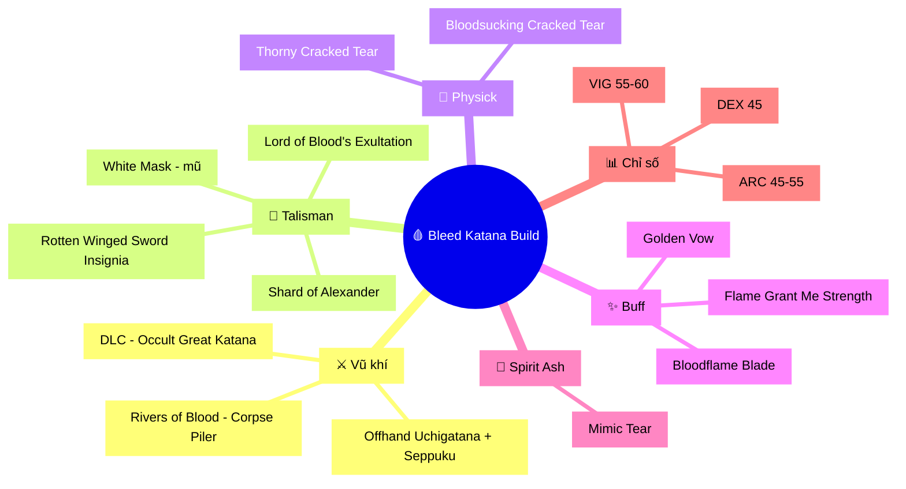
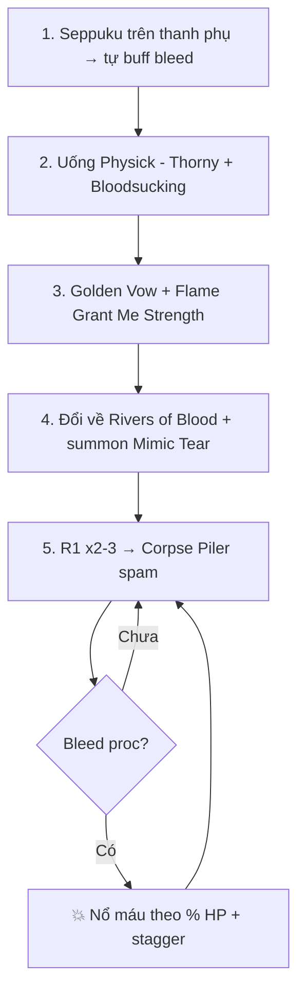

# 🩸 Elden Ring - Lộ trình Build Bleed-Katana (Samurai)

> Guide chi tiết cho class **Samurai**, đi hướng **Dex/Arcane Bleed Katana** - build được cộng đồng YouTube + Reddit crown là **chơi phê nhất**, đồng thời damage cao top đầu (Rivers of Blood).
> Vị trí item đã verify qua wiki (game8 / fextralife). Cập nhật: có DLC Shadow of the Erdtree.

---

## Mục lục
1. [Định hướng tổng thể](#1-định-hướng-tổng-thể)
2. [Cơ chế Bleed](#2-cơ-chế-bleed-hemorrhage)
3. [Lộ trình vũ khí](#3-lộ-trình-vũ-khí-tổng-quan)
4. [Phase 1-4 chi tiết](#4-chi-tiết-từng-phase)
5. [Loadout cuối game](#5-loadout-cuối-game)
6. [Combat rotation](#6-combat-rotation-cách-đánh-mỗi-trận)
7. [Chỉ số theo phase](#7-chỉ-số-theo-phase)
8. [Caveat cần nhớ](#8-caveat-cần-nhớ)

---

## 1. Định hướng tổng thể

- **Trục chỉ số:** VIG (máu) → DEX (đánh nhanh, cầm katana) → **ARC (Arcane - tăng tốc tích bleed + damage Corpse Piler)** → END (stamina) → MIND (FP).
- **Vũ khí xuyên suốt:** Uchigatana → Nagakiba → **Rivers of Blood** (core) → DLC: **Occult Great Katana**.
- **Ý tưởng:** đánh R1 nhanh chồng bleed → skill → thanh máu nổ theo % máu tối đa → lặp. Boss càng trâu máu càng tan nhanh.

---

## 2. Cơ chế Bleed (Hemorrhage)

Bleed tích một **thanh ẩn** trên địch; đầy thì **nổ** một cục damage = lượng cố định **+ % máu tối đa** của địch, kèm khựng nhẹ (stagger).

**Tăng sức bleed:** điểm **Arcane** cao → tích bleed nhanh hơn; **Seppuku** (tự chảy máu) buff damage bleed; talisman **Lord of Blood's Exultation** + mũ **White Mask** tăng damage sau khi proc.

---

## 3. Lộ trình vũ khí (tổng quan)

### Timeline gom item

---

## 4. Chi tiết từng Phase

### PHASE 1 - Đầu game (Limgrave → Liurnia, ~Lv1-40)

- Giữ **Uchigatana** khởi đầu (sẵn bleed). Ash gợi ý: **Unsheathe** hoặc **Bloody Slash**.
- Power-spike sớm: **Bloodhound's Fang** - giết **Bloodhound Knight Darriwil** ở **Forlorn Hound Evergaol** (Limgrave). Dex/Str + bleed + skill né-đánh, nuôi tới DLC được.
- **Chỉ số:** dồn **VIG ~30**, DEX ~20-25. Chưa vội Arcane.

### PHASE 2 - Giữa game (~Lv40-80)

- **Nagakiba:** hoàn thành **questline Yura** (gặp lần đầu ở **Murkwater Coast**, Limgrave). Katana **dài nhất game**, thuần Dex, tầm với an toàn.
- Có thể **dual-wield 2 katana** (powerstance) nếu thích nhịp dày.
- **Chỉ số:** VIG → 40, DEX → 30-40. Nếu chắc đi Rivers of Blood thì nhấc **ARC ~15-20**.
- **Talisman:** **Winged Sword Insignia** (bản thường), bắt đầu **questline Millicent**.
- **Black Whetblade** (Nokron) nếu muốn infuse Blood affinity cho vũ khí thường (native-bleed thì không cần).

### PHASE 3 - Cuối game (~Lv80-130) · CORE BUILD

- **Rivers of Blood** ⭐: giết invader **Bloody Finger Okina** ở **Church of Repose, Mountaintops of the Giants**. Yêu cầu **12 STR / 18 DEX / 20 ARC**. Skill **Corpse Piler**.
- **Seppuku:** ở **hồ băng phía đông grace "Freezing Lake"** (Mountaintops), từ **Teardrop Scarab tàng hình** men bờ hồ. Grants Blood affinity + tự đâm mình buff damage bleed 60s.
  - **Kỹ thuật:** để Seppuku trên **Uchigatana phụ (offhand)** → buff trước trận → đổi về Rivers of Blood đánh.

### PHASE 4 - DLC Shadow of the Erdtree (Lv130+)

- **Cày Scadutree Fragment BẮT BUỘC** - DLC scale damage/def theo Scadutree Blessing, không phải level. (Rivers of Blood base game **không** được scadutree scale → nên chuyển vũ khí DLC.)
- **Occult Great Katana** ⭐: nhặt **Great Katana** ~2 phút đầu DLC ở **Gravesite Plain**, cạnh **Ghostflame Dragon đang ngủ** trên hồ, tây grace "Abandoned Ailing Village". **Infuse Occult** (double bleed buildup, đáng hơn Keen).
- **Ash of War Savage Lion's Claw:** từ grace **"Three-Path Cross"**, men tường trái đi bắc tới trại nhỏ. Phá poise tốt, dùng được cả boss miễn bleed.

---

## 5. Loadout cuối game

### Bảng talisman + vị trí

| Talisman | Hiệu ứng | Lấy ở đâu |
|----------|----------|-----------|
| **Lord of Blood's Exultation** | +20% damage 20s khi có bleed gần | Leyndell Catacombs - giết boss Esgar; từ grace "Underground Ditch" xuống thang tường |
| **White Mask** (mũ) | +10% damage 3 đòn sau khi proc bleed | Khu **Mohgwyn Dynasty Mausoleum** |
| **Rotten Winged Sword Insignia** | +6/8/13% theo đòn liên tiếp | Cuối **questline Millicent** (chọn giúp giết chị em) |
| **Shard of Alexander** | +15% damage skill (buff Corpse Piler) | Questline Alexander (Iron Fist) |

> ⚠️ Cuối questline Millicent chỉ chọn **1 trong 2**: **Rotten Winged Sword Insignia** (giúp cô ấy) HOẶC **Millicent's Prosthesis** (+5 DEX, thách đấu). → Chọn **Rotten Winged Sword Insignia**.

---

## 6. Combat rotation (cách đánh mỗi trận)

Seppuku tự proc luôn White Mask + Lord of Blood's Exultation **trước** khi vào boss → vào trận đã có sẵn buff.

---

## 7. Chỉ số theo phase

| Phase | VIG | MIND | END | STR | DEX | ARC |
|-------|-----|------|-----|-----|-----|-----|
| P1 (Lv1-40) | 30 | 12 | 15 | 14 | 20-25 | 8 |
| P2 (Lv40-80) | 40 | 14 | 20 | 14 | 30-40 | 15-20 |
| P3 (Lv80-130) | 50-55 | 15-18 | 25 | 14 | 45 | 35-45 |
| Endgame (~Lv150) | 55-60 | 20 | 25-30 | 14 | 45 | 45-55 |

> Samurai sẵn Dex nên chỉ cần vài **Larval Tear** đổi Mind/Str dư sang Arcane. Respec ở **Rennala** (sau khi hạ Rennala tại Raya Lucaria).

---

## 8. Caveat cần nhớ

- **Boss miễn bleed** (một số rồng, undead, vài boss DLC): dùng **Savage Lion's Claw / physical thường**, đừng dựa vào proc.
- **Rotten Winged Sword vs Millicent's Prosthesis:** chỉ 1/lượt chơi → chọn Rotten Winged Sword.
- **PvP:** talisman "đòn liên tiếp" yếu đi (địch lăn sau 1 đòn); bleed vẫn ổn nhưng meta khác PvE.
- **Respec rẻ** → chỉnh Dex/Arcane thoải mái.
- **DLC:** phải cày Scadutree, và ưu tiên vũ khí DLC-native (Great Katana) vì RoB base game không được scadutree scale.

---

### Nguồn tham khảo (đã verify)
- Corpse Piler / Rivers of Blood, Seppuku: game8.co, fextralife wiki
- Great Katana / Savage Lion's Claw (DLC): fextralife wiki, "Savage Slasher" build guide
- Talisman bleed (Lord of Blood's Exultation, White Mask, Rotten Winged Sword, Millicent's Prosthesis): fextralife, beebom, erdtreeforge
