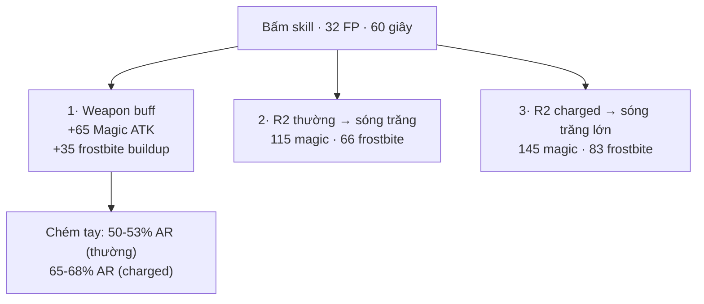
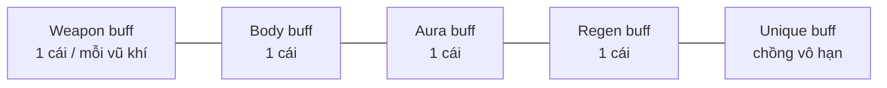
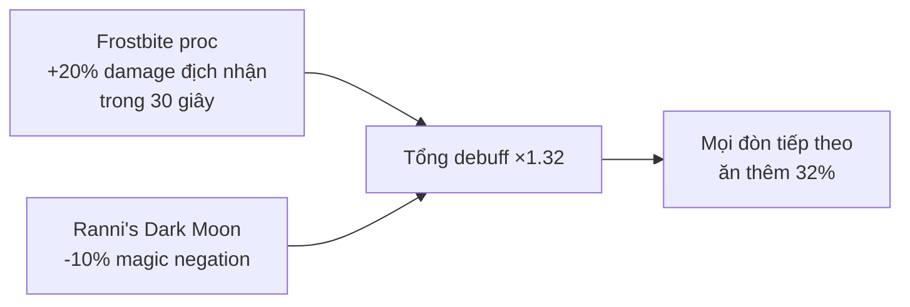
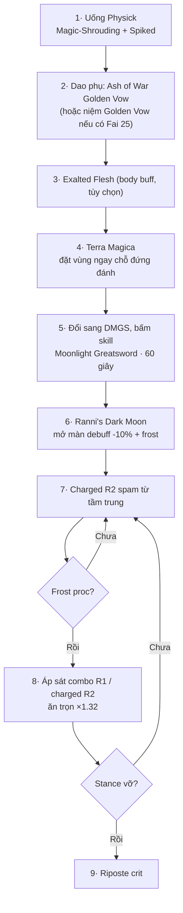

# 🌑 Dark Moon Greatsword - Build tổng hợp (item / talisman / skill / buff)

> Kiếm cuối questline Ranni. Guide này gom **tất cả** item ăn khớp với nó: talisman, giáp, physick, phép buff, vũ khí phụ, spirit ash, consumable, cùng thứ tự bật buff và bảng nhân damage.
> Mọi con số đều verify qua wiki (eldenring.wiki.gg / fextralife), patch hiện hành 1.16. Xem thêm guide anh em: [Moonveil + Dark Moon INT spellblade](./elden-ring-moonveil-darkmoon-int-build-guide.md).

---

## 1. Hiểu vũ khí trước, chọn item sau

Đây là phần quyết định **item nào có tác dụng, item nào vô dụng**. Dark Moon Greatsword (DMGS) gây damage qua **3 nguồn khác nhau**, mỗi nguồn ăn buff khác nhau.

| Chỉ số | Giá trị |
|--------|---------|
| Yêu cầu | **Str 16** (1 tay) / **Str 11** (2 tay) · Dex 11 · **Int 38** |
| Scaling +10 | Str D / Dex D / **Int B** |
| Attack +10 | Physical 141 + **Magic 169** (nghiêng phép) |
| Nặng | 10.0 · Guard 44 · Crit 100 |
| Passive | Frostbite buildup **55** |
| Skill | **Moonlight Greatsword** - 32 FP, **kéo dài 60 giây** |
| Loại | Somber (+10), **không đổi affinity / không gắn Ash of War khác** |

### Skill Moonlight Greatsword tách làm 3 phần

**Ba nguồn damage, ba nhóm buff:**

| Nguồn | Ăn buff nào |
|-------|-------------|
| **Sóng trăng (projectile)** | Skill talisman (Shard of Alexander), charged talisman (Godfrey Icon), Spellblade set, magic buff (Terra Magica, physick, Magic Scorpion Charm) |
| **Chém tay (melee swing)** | Two-Handed Sword Talisman, magic buff (phần magic), physical buff (phần physical), Golden Vow |
| **Frostbite tích lũy** | Không có talisman nào tăng frostbite buildup trực tiếp, nhưng chồng thêm nguồn frost khác (phép frost, vũ khí phụ frost) |

> ⚠️ **Shard of Alexander KHÔNG tăng đòn chém tay.** Nó chỉ tăng **sóng trăng** (phần được tính là skill damage). Nhiều guide nói mập mờ chỗ này.

---

## 2. Talisman - danh sách đầy đủ

Chỉ có **4 slot**, nên phần này chia theo mức ưu tiên, kèm cả nhóm "trông có vẻ hợp nhưng không hoạt động".

### 2.1 Nhóm core (tăng damage trực tiếp cho DMGS)

| Talisman | Hiệu ứng chính xác | Áp dụng cho | Lấy ở đâu |
|----------|--------------------|-------------|-----------|
| **Shard of Alexander** | +15% attack power của **Skill** | Sóng trăng (cả charged lẫn thường) | Cuối questline Iron Fist Alexander |
| **Godfrey Icon** | +15%, **chỉ khi đòn được charge** | Sóng trăng từ **charged R2** | Godefroy the Grafted, Golden Lineage Evergaol (Altus) |
| **Magic Scorpion Charm** | **+12% magic damage**, đổi lại **+10% physical damage nhận vào** | Cả sóng trăng lẫn phần magic của đòn chém | Seluvis, sau khi đưa Amber Starlight (phải làm **trước** khi đưa Fingerslayer Blade cho Ranni) |
| **Two-Handed Sword Talisman** (DLC) | **+15%** đòn đánh **cầm 2 tay** | Chỉ **melee swing**, KHÔNG áp dụng projectile | Temple Town Ruins, Ancient Ruins of Rauh (DLC) |
| **Warrior Jar Shard** | +10% attack power của Skill | Sóng trăng | **Không stack với Shard of Alexander**, chỉ dùng khi chưa có Shard |

### 2.2 Nhóm phụ trợ damage (tùy tình huống)

| Talisman | Hiệu ứng | Khi nào dùng |
|----------|----------|--------------|
| **Axe Talisman** | **×1.1 cho charged heavy melee attack**, áp dụng **mọi loại vũ khí** (không riêng rìu) | ⚠️ Wiki nêu đích danh: **KHÔNG** buff viên đạn sóng trăng của DMGS. Chỉ tăng đòn chém charged. Hợp preset cận chiến, vô nghĩa với lối chơi bắn sóng |
| **Rotten Winged Sword Insignia** | Đánh liên tiếp: +6% / +8% / +13% | Khi áp sát combo R1 liên tục, boss ít né |
| **Winged Sword Insignia** | Bản yếu hơn của trên | Chưa xong quest Millicent |
| **Ritual Sword Talisman** | +10% attack khi **HP đầy** | Boss burst mở màn, hoặc chơi né tốt không ăn đòn |
| **Millicent's Prosthesis** | +5 Dex và tăng dần damage khi đánh liên tiếp | Không tối ưu (Dex không scale mạnh cho DMGS) |
| **Carian Filigreed Crest** | **-25% FP** cho skill | Khi Mind thấp, muốn bật lại skill 60 giây liên tục |
| **Stargazer Heirloom** | +5 Intelligence | Đẩy INT qua mốc 60/68 mà không tốn level |
| **Radagon Icon** | Rút ngắn thời gian niệm phép | Chỉ có tác dụng khi cầm gậy niệm phép thật (Ranni's Dark Moon, Terra Magica) |
| **Crusade Insignia** (DLC) | +15% attack trong 20 giây sau khi giết địch | Dọn map / trash mob, không dùng cho boss 1 mạng |
| **Rellana's Cameo** (DLC) | Tăng đòn đánh sau khi giữ nguyên tư thế một lúc | Playstyle đứng chờ, canh R2 charged |
| **Shattered Stone / Sharpshot / Smithing Talisman** (DLC) | Kick/stomp, bắn xa, ném vũ khí | ❌ Không liên quan DMGS |

### 2.3 Nhóm thủ + tiện ích

| Talisman | Hiệu ứng | Ghi chú |
|----------|----------|---------|
| **Dragoncrest Greatshield Talisman** | Giảm mạnh physical damage nhận vào | Bù đúng cái penalty của Magic Scorpion Charm |
| **Erdtree's Favor +2** | +HP, +stamina, +equip load | Slot "an toàn" chung, hợp vì DMGS nặng 10.0 |
| **Green Turtle Talisman** | Tăng hồi stamina | Greatsword tốn stamina, charged R2 càng tốn |
| **Two-Headed Turtle Talisman** (DLC) | **+10 stamina/giây, tức +22.2%** hồi stamina | Bản mạnh hơn của Green Turtle. **Không đeo được cùng lúc** với Green Turtle (cùng dòng variant). Rivermouth Cave, Gravesite Plain |
| **Blessed Blue Dew Talisman** (DLC) | Hồi **1 FP mỗi 2 giây**, không tắt được | Bù FP cho việc bật lại skill 32 FP mỗi 60 giây. Church of Benediction, Gravesite Plain |
| **Crimson Amber Medallion +2** | +HP tối đa | Thay cho Erdtree's Favor nếu chỉ cần máu |
| **Bull-Goat's Talisman** | +poise | Khi muốn tank đòn để hoàn thành charged R2 |
| **Assassin's Cerulean Dagger** | Hồi FP khi crit | Combo với việc phá stance → riposte |
| **Dagger Talisman** | **×1.17 damage đòn crit (riposte/backstab)** | Hợp bất ngờ với build này: DMGS phá stance rất nhanh nên riposte nhiều. Volcano Manor, cần 2 Stonesword Key |
| **Marika's Soreseal** | +5 Mind/Int/Fai/Arc, **+15% damage nhận vào** | Rất mạnh ở level thấp/trung (đẩy INT), rủi ro ở endgame |
| **Radagon's Soreseal** | +5 Vig/End/Str/Dex, +15% damage nhận vào | Giúp đủ Str/End sớm, cùng rủi ro trên |

### 2.4 ❌ Talisman KHÔNG hoạt động với DMGS (bẫy phổ biến)

| Talisman | Vì sao vô dụng |
|----------|----------------|
| **Graven-Mass Talisman** | Chỉ tăng **sorcery niệm bằng gậy**, không đụng tới weapon skill |
| **Graven-School Talisman** | Như trên |
| **Magic Cluster / Lucid Sword Talisman** (nếu chơi DLC) | Chỉ boost phép, không boost skill của vũ khí |
| **Aged One's Exultation** (DLC) | Chỉ kích hoạt bởi **Madness**, KHÔNG phải frostbite (khác với Kindred of Rot's Exultation dùng poison/rot) |
| **Axe Talisman** (với lối chơi bắn sóng) | Wiki ghi rõ nó **không** buff viên đạn charged của Dark Moon Greatsword. Vẫn hữu ích nếu chém tay, xem mục 2.2 |
| **Spear / Lance / Arrow's Reach Talisman** | Sai loại vũ khí |
| **Kindred of Rot's Exultation** | Cần poison/scarlet rot ở gần, build này không tạo được |

### 2.5 Ba preset 4-slot đề xuất

| Preset | Slot 1 | Slot 2 | Slot 3 | Slot 4 | Dùng khi |
|--------|--------|--------|--------|--------|----------|
| **A - Burst sóng trăng (boss)** | Shard of Alexander | Godfrey Icon | Magic Scorpion Charm | Spellblade set đã cover armor → chọn Dragoncrest Greatshield | Đánh boss từ tầm trung, spam charged R2 |
| **B - Cận chiến 2 tay** | Shard of Alexander | Two-Handed Sword Talisman | Magic Scorpion Charm | Rotten Winged Sword Insignia (hoặc **Axe Talisman** nếu chủ yếu charged R2 chém tay) | Boss buộc phải áp sát, combo R1 |
| **C - Sống sót / DLC** | Shard of Alexander | Godfrey Icon | Dragoncrest Greatshield | Erdtree's Favor +2 | DLC, boss đánh đau, hoặc thiếu Scadutree |

---

## 3. Giáp - set nào thực sự tốt nhất

Câu trả lời phụ thuộc **cách đánh**, vì Spellblade's Set đánh đổi gần như toàn bộ poise để lấy 8% damage.

### 3.1 Số liệu Spellblade's Set (drop từ Sorcerer Rogier)

| Món | Nặng | Poise | Bonus |
|-----|------|-------|-------|
| Spellblade's Pointed Hat | 1.5 | **0** | +2% |
| Spellblade's Traveling Attire | 3.3 | **1** | +2% |
| Spellblade's Gloves | 1.2 | **0** | +2% |
| Spellblade's Trousers | 2.6 | **1** | +2% |
| **Tổng** | **8.6** | **2** | **+8% magic damage cho weapon skill** |

**Poise tổng chỉ có 2.** Nghĩa là bất kỳ đòn nào chạm vào cũng ngắt animation. Trong khi playstyle chính của DMGS là **charged R2**, một animation dài rất dễ bị ngắt giữa chừng.

### 3.2 Mốc poise cần biết

| Mốc | Ý nghĩa |
|-----|---------|
| **51** | Mốc quan trọng nhất trong PvE, chịu được nhiều đòn nhẹ (dao găm, kiếm thẳng) mà không khựng |
| **61** | Trade được với vũ khí trung bình (katana, kiếm thẳng) |
| **101** | Trade được với greatsword / colossal |

Greatsword **có hyper armor khi cầm 2 tay và đang trong animation tấn công**, nhưng hyper armor vẫn cần poise để trụ. Poise 2 thì hyper armor gần như vô nghĩa.

Poise phân bổ chủ yếu ở **áo và quần**; mũ và găng đóng góp rất ít. Đây chính là kẽ hở để mix.

### 3.3 Ba cấu hình giáp theo lối chơi

| Cấu hình | Trang bị | Được | Mất |
|----------|----------|------|-----|
| **Full Spellblade** ⭐ đánh xa | 4 món Spellblade (8.6 nặng, poise 2) | +8% damage, equip load cực nhẹ, roll thoải mái | Poise 2, bị ngắt bởi mọi đòn |
| **Mix thông minh** ⭐ cân bằng | **Spellblade Hat + Gloves** (2.7 nặng, poise 0) + **áo/quần giáp nặng** | +4% damage, giữ được phần lớn poise (vì hat/gloves vốn đã 0 poise, thay chúng cũng chẳng thêm poise) | Mất 4%, cần END gánh nặng |
| **Full giáp nặng** áp sát/trade | Black Knight Set (poise 60, nặng 32.7) hoặc Scaled Set (poise 71, nặng 38.0), Lionel's (poise 86), Veteran's (poise 77) | Vượt mốc 51/61, hoàn thành charged R2 kể cả khi bị đánh | Mất trọn 8%, tốn nhiều END |

> **Chốt:** nếu anh đánh boss theo kiểu **đứng tầm trung bắn sóng trăng** thì **full Spellblade là tốt nhất** (poise vô nghĩa khi không ai chạm được vào mình). Nếu phải **áp sát trade đòn**, dùng **mix thông minh**: giữ Spellblade Hat + Gloves cho +4% rồi mặc áo/quần nặng, vì hai món đó vốn cho 0 poise nên đổi sang giáp nặng cũng không được thêm poise bao nhiêu.

### 3.4 Mũ thay thế (đổi 2% lấy hiệu ứng khác)

| Món | Hiệu ứng | Nặng / Poise | Có đáng đổi? |
|-----|----------|--------------|--------------|
| **Snow Witch Hat** | +10% damage cho **cold sorcery**: Glintstone Icecrag, Adula's Moonblade, Zamor Ice Storm, **Ranni's Dark Moon** | - | ✅ Nếu niệm Ranni's Dark Moon thường xuyên. ❌ Nếu chỉ cast 1 lần mở màn thì giữ Spellblade Hat |
| **Twinsage Glintstone Crown** | **+6 INT**, đổi lại **-9% HP và -9% stamina** | 5.1 / - | Đáng khi Vigor thấp, trên 40 Vigor thì lỗ |
| **Preceptor's Big Hat** | **+3 Mind**, **-9% stamina** | 3.6 / 5 | Khi FP hụt liên tục. Xác Seluvis ở Seluvis's Rise |
| **Navy Hood** | **+1 Mind** | 1.7 / - | Món nhẹ nhất có stat, dùng để chạm đúng mốc FP |
| **Queen's Crescent Crown / Karolos / Hierodas** | +INT nhẹ, penalty nhẹ hơn Twinsage | - | Thay Twinsage ở endgame Vigor cao |
| **Lusat's Glintstone Crown** | +INT nhưng **tăng FP tiêu thụ** | - | ❌ Không hợp: skill 32 FP bật lại liên tục sẽ đói FP |
| **Blaidd's Armor Set** | Poise tốt, hợp thẩm mỹ Ranni | - | Chọn nếu ưu tiên tạo hình + poise |

---

## 4. Flask of Wondrous Physick (2 tia)

| Tear | Hiệu ứng chính xác | Ưu tiên |
|------|--------------------|---------|
| **Magic-Shrouding Cracked Tear** | **+20% magic damage**, 180 giây | ⭐ Bắt buộc. Buff cả sóng trăng lẫn phần magic đòn chém |
| **Bloodsucking Cracked Tear** (DLC) | **+20% attack power TOÀN BỘ** (cả physical lẫn magic), 180 giây, đổi lại **mất (0.2% máu tối đa + 20) HP mỗi giây** | ⭐ Mạnh hơn Spiked vì buff mọi nguồn damage. Né/lăn có i-frame thì "dodge" được nhịp mất máu. Furnace Golem ở Ruins of Unte, Scadu Altus |
| **Spiked Cracked Tear** | **+15% charged heavy attack**, 180 giây | ⭐ Tia thứ 2 tốt nhất cho playstyle charged R2 nếu không muốn mất máu |
| **Intelligence-knot Crystal Tear** | **+10 INT**, 3 phút | Thay thế nếu đang thiếu INT để chạm mốc 60/68 |
| **Stonebarb Cracked Tear** | **+30% poise/stance/stamina damage**, 30 giây | Burst phá stance để riposte, thời lượng ngắn |
| **Cerulean Hidden Tear** | Không tốn FP trong 15 giây | Combo mở màn: niệm hết buff + spam skill miễn phí |
| **Opaline Hardtear** | Giảm mọi loại damage nhận vào | Slot thủ khi tập boss khó |
| **Greenburst / Crimsonburst** | Hồi stamina / hồi máu dần | Tùy nhu cầu sinh tồn |

**Combo khuyến nghị:**
- Có DLC, tự tin né: `Magic-Shrouding` + `Bloodsucking` (mạnh nhất, ×1.20 magic × ×1.20 toàn bộ)
- An toàn: `Magic-Shrouding` + `Spiked Cracked Tear`
- Chưa đủ INT: `Magic-Shrouding` + `Intelligence-knot`

---

## 5. Skill và phép buff (đây là chỗ nhân damage lớn nhất)

### 5.1 Luật chồng buff của Elden Ring

Buff chia **6 nhóm**, mỗi nhóm chỉ **1 buff active** cùng lúc (nhóm Unique thì chồng thoải mái):

> 🔴 **Hệ quả quan trọng:** skill Moonlight Greatsword **chính là weapon buff**. Nghĩa là khi skill đang bật, **không thể bôi thêm grease (Freezing Grease, Magic Grease) hay niệm Scholar's Armament lên DMGS**. Bôi grease sẽ **xóa** buff skill. Đừng phí item.

### 5.2 Buff nên dùng (đều chồng được với nhau)

| Buff | Nhóm | Hiệu ứng chính xác | Yêu cầu |
|------|------|--------------------|---------|
| **Moonlight Greatsword** (skill) | Weapon buff | +65 magic ATK, +35 frostbite, mở khóa sóng trăng, 60 giây | 32 FP |
| **Terra Magica** | Unique (vùng đất) | **+22.5% magic damage** (đã bị nerf từ 35% ở patch 1.12), 30 giây, bán kính 4.2m | Int 20, 20 FP. Rương sau boss Academy Crystal Cave |
| **Golden Vow** (incantation) | Aura buff | **+15% attack, +10% damage negation, 80 giây** | Fai 25, 47 FP |
| **Ash of War: Golden Vow** | Aura buff | Yếu hơn bản incant (~+10% attack, 45 giây) nhưng **không cần điểm Faith** | Gắn lên dao/vũ khí phụ, bấm buff rồi đổi tay sang DMGS. Drop từ Godrick Knight cưỡi ngựa ở Stormhill |
| **Contagious Fury** (skill khiên Jellyfish Shield) | **Unique buff** (chồng được với cả body buff lẫn weapon buff) | **+12.5% attack power**, 30 giây, 9 FP | ⚠️ Xem caveat ngay dưới bảng, món này **không dùng được** với lối chơi 2 tay |
| **Exalted Flesh** | Body buff | **+20% physical damage**, 30 giây | Craft. Chỉ buff phần physical (~45% damage DMGS), hiệu quả trung bình |
| **Bloodboil Aromatic** | Body buff | **+30% physical damage**, 60 giây, đổi lại **-25% MỌI damage negation** | Mạnh hơn Exalted Flesh nhưng rất rủi ro, cộng dồn penalty với Magic Scorpion Charm thì rất dễ chết |
| **Flame, Grant Me Strength** | Body buff | +physical/fire attack | Cùng nhóm với Exalted Flesh và Bloodboil, **chỉ chọn được 1** |
| **Black Flame's Protection** | **Body buff** (không phải aura buff) | **-35% physical damage nhận vào**, 70 giây, 30 FP, đổi lại **-20% hiệu quả hồi máu** (nên lợi ích thực chỉ còn ~18.75%) | ⚠️ Cần **Faith 30**, build INT thuần niệm không được. Vì là body buff nên **đè lên** Exalted Flesh / Bloodboil / Flame Grant Me Strength. Chỉ chồng được với Golden Vow |
| **Magic Fortification** | Body buff | +kháng magic | Dùng khi boss đánh phép, đánh đổi mất slot body buff tấn công |

> ⚠️ **Bẫy Jellyfish Shield:** buff Contagious Fury **biến mất ngay khi khiên không nằm trên tay**, kể cả trường hợp cầm 2 tay vũ khí (khiên tự đeo ra sau lưng). Nghĩa là build DMGS 2 tay (vốn ăn +15% Two-Handed Sword Talisman) **không giữ được buff này**. Nhiều guide trên YouTube nhắc Jellyfish Shield mà bỏ qua chi tiết này.
>
> **Mẹo giảm yêu cầu chỉ số:** cầm **2 tay khiên** để bấm skill (chỉ cần **Str 14** thay vì 20), rồi đổi về **1 tay** (khiên trái, DMGS phải). Buff giữ nguyên vì khiên vẫn ở trên tay. Nhưng lưu ý mẹo này **chỉ tiết kiệm điểm Str, không cho phép cầm DMGS 2 tay**: hễ 2-hand kiếm là buff bay ngay. Bài toán vẫn là chọn giữa Contagious Fury +12.5% (1 tay) và Two-Handed Sword Talisman +15% (2 tay), cộng thêm việc phải nuôi **Dex 14** cho khiên.

### 5.3 Phép sorcery đi kèm (cầm thêm 1 gậy)

| Phép | Vai trò | Yêu cầu |
|------|---------|---------|
| **Ranni's Dark Moon** ⭐ | **Giảm -10% magic negation** của địch + **270 frostbite buildup** | **Int 68**, 57 FP, **2 memory slot**. Chelona's Rise (giải puzzle 3 rùa linh) |
| **Rennala's Full Moon** | Cũng **-10% magic negation**, damage gốc cao hơn (360% vs 330% sorcery scaling) nhưng **không gây frostbite** | **Int 70**, 47 FP, 2 memory slot. Đổi Remembrance của Rennala. ⚠️ Cùng loại debuff với Ranni's Dark Moon nên **không cộng dồn**, chọn 1. Build này nên chọn Ranni's vì cần frostbite |
| **Rock Sling** | Damage **vật lý** + phá stance mạnh | Cứu cánh khi gặp boss kháng phép |
| **Carian Slicer** | Đòn nhanh, rẻ FP, tầm gần | Lấp khoảng trống khi hết stamina |
| **Adula's Moonblade** | Chém + phóng lưỡi băng, tích frostbite | Nguồn frost thứ 2, tăng tốc proc |
| **Glintstone Icecrag** | Frost buildup rẻ tiền | Mở màn proc frost sớm |
| **Loretta's Mastery / Comet Azur / Founding Rain of Stars** | Burst tầm xa | Chỉ đáng khi INT ≥ 70 và có Cerulean Hidden Tear |
| **Night Comet** | Địch không thấy đường phép bay tới | PvP / một số boss |

### 5.4 Combo debuff - lý do build này bào boss nhanh

Frostbite proc = địch nhận thêm **20% damage mọi loại trong 30 giây**. Cộng Ranni's Dark Moon (-10% magic negation) thành **tổng 32%**. DMGS vừa là nguồn frost (55 passive + 35 từ buff + 83 mỗi charged wave) vừa là thứ hưởng lợi nhất từ debuff đó.

---

## 6. Vũ khí phụ và gậy

| Món | Vai trò |
|-----|---------|
| **Carian Regal Scepter** | Gậy tốt nhất: **+10% cho Full Moon sorceries** (Rennala's Full Moon, **Ranni's Dark Moon**, Rellana's Twin Moons). Đổi từ Rennala remembrance |
| **Lusat's Glintstone Staff** | Damage phép cao nhất nhưng **+FP tiêu thụ**, hợp burst 1 phát |
| **Azur's Glintstone Staff** | Giảm thời gian niệm, hợp Comet Azur |
| **Dao nhẹ gắn Ash of War: Golden Vow** | Cầm tay trái, bấm buff aura rồi đổi sang DMGS. Món must-have cho INT build không có Faith |
| **Moonveil** | Vũ khí phụ tầm xa, Transient Moonlight cũng ăn **Spellblade set + Shard of Alexander** |
| **Wing of Astel** | L2 phóng sao magic, cùng hệ INT |
| **Jellyfish Shield** | Skill Contagious Fury +12.5% attack (unique buff). Chỉ hợp lối chơi **1 tay**, cần Str 20 + Dex 14. Cầm 2 tay là mất buff |
| **Icerind Hatchet / Frozen Needle** | Nguồn frost phụ nếu muốn proc frostbite nhanh hơn |
| **Sword of Night and Flame** | Alt INT/Fai, không chung hướng buff |
| **Khiên nhẹ + Barricade Shield** | Nếu chơi 1 tay (nhưng mất +15% từ Two-Handed Sword Talisman) |

> **Lưu ý cầm 2 tay:** cầm 2 tay chỉ cần **Str 11** thay vì 16, lại mở khóa **Two-Handed Sword Talisman +15%**. Đây là lý do phần lớn build DMGS chơi 2 tay và dồn điểm dư vào INT/Vigor.

---

## 7. Spirit Ash và consumable

| Món | Vai trò |
|-----|---------|
| **Mimic Tear +10** | Copy nguyên build, tự bật skill và bắn sóng trăng. Mạnh nhất tổng thể |
| **Black Knife Tiche** | Kéo aggro tốt, damage % máu |
| **Latenna** | Damage tầm xa an toàn khi mình giữ khoảng cách charged R2 |
| **Boiled Crab / Boiled Prawn** | +physical / +magic negation, bù penalty Magic Scorpion Charm |
| **Bewitching Branch** | Biến trash mob thành đồng minh |
| **Larval Tear** | Respec ở Rennala để chuyển sang INT |
| **Godrick's Great Rune** | +5 tất cả stat, giúp chạm mốc Str/Int |
| **Radahn's Great Rune** | +HP/FP/stamina tối đa, hợp playstyle spam skill |

---

## 8. Chỉ số (build tổng hợp)

| Stat | Level ~125 (PvP meta) | Level ~150-180 (PvE/DLC) | Lý do |
|------|----------------------|--------------------------|-------|
| **VIG** | 40 | **55-60** | DMGS nặng, phải áp sát để chém |
| **MIND** | 20 | **25-30** | Skill 32 FP × nhiều lần + Ranni's Dark Moon 57 FP |
| **END** | 20 | **25-30** | Stamina cho charged R2 + gánh giáp Spellblade |
| **STR** | 11 | **11** (2 tay) hoặc 16 (1 tay) | Cầm 2 tay tiết kiệm 5 điểm |
| **DEX** | 11 | 11 (hoặc **18** nếu cầm thêm Moonveil) | Không scale đáng kể |
| **INT** | 60 | **68-80** | ⭐ Trục chính |
| FAI / ARC | 0 | 0 (hoặc 25 Fai nếu muốn Golden Vow bản incant) | |

### Biến thể INT/Faith (hybrid)

Một số guide chạy **Faith 30** để niệm được **Golden Vow** bản incantation (+15% thay vì ~+10% của Ash of War) và **Black Flame's Protection** (-35% physical damage). Ví dụ: Vig 40 / Mind 28 / End 32 / Str 16 / Dex 11 / **Int 62** / **Fai 30**.

**Đánh đổi:** 30 điểm vào Faith là 30 level không vào INT hoặc Vigor. Đổi lại chỉ được **+5% Golden Vow** so với bản Ash of War, cộng một body buff phòng thủ. Nếu chơi PvE thường, dồn 30 điểm đó vào **INT 80 + Vigor 60** cho kết quả tốt hơn. Biến thể Faith chỉ đáng khi anh thích lối chơi trâu, đứng trade đòn.

**Mốc INT cần nhớ:**
- **38** - mốc tối thiểu cầm được kiếm
- **60** - softcap chính của scaling, damage/điểm bắt đầu giảm
- **68** - ⭐ mốc niệm được **Ranni's Dark Moon**
- **80** - hard cap, sau đó gần như không tăng

---

## 9. Bảng nhân damage (charged R2 sóng trăng)

Các buff nhân với nhau (multiplicative), preset A + full buff:

| Nguồn | Hệ số |
|-------|-------|
| Shard of Alexander | ×1.15 |
| Godfrey Icon (charged) | ×1.15 |
| Magic Scorpion Charm | ×1.12 |
| Spellblade's Set 4 món | ×1.08 |
| Terra Magica | ×1.225 |
| Magic-Shrouding Cracked Tear | ×1.20 |
| Golden Vow (incant) | ×1.15 |
| **Tổng buff bản thân** | **≈ ×2.70** |
| Debuff địch (frostbite + Ranni's Dark Moon) | ×1.32 |
| **Tổng cộng** | **≈ ×3.57** |

Thêm **Bloodsucking Cracked Tear** vào tia physick thứ 2 (thay Spiked) thì nhân thêm **×1.20 cho toàn bộ damage**, đẩy tổng lên **≈ ×4.28**, đổi lại mất máu liên tục.

Nếu chơi preset B (cận chiến), thay Godfrey Icon bằng Two-Handed Sword Talisman: đòn chém ăn ×1.15, nhưng **sóng trăng mất phần charged bonus**. Với preset B, **Axe Talisman ×1.1** cộng thêm vào đòn chém charged (không cộng vào sóng).

---

## 10. Thứ tự bật buff (rotation trước boss)

**Lưu ý vận hành:**
- Terra Magica là **vùng cố định trên mặt đất**, boss di chuyển thì phải đặt lại. Chỉ 30 giây.
- Skill 60 giây, hết thì bấm lại (nhớ Carian Filigreed Crest nếu FP căng).
- Charged R2 tốn nhiều stamina, đừng spam liên tục tới cạn (Green Turtle Talisman giúp nhiều).
- **Cerulean Hidden Tear** cho phép bật toàn bộ chuỗi buff mà không tốn FP nào.

---

## 11. Caveat và điểm yếu

- **Không dùng được grease.** Skill là weapon buff, bôi grease sẽ xóa buff. Nhiều người lãng phí Freezing Grease vì tưởng chồng được.
- **Graven-Mass / Graven-School không có tác dụng.** Đây là nhầm lẫn phổ biến nhất của build này.
- **Magic Scorpion Charm là con dao 2 lưỡi:** +12% magic nhưng ăn thêm 10% physical damage. Nếu boss đánh vật lý nặng (Malenia, Radahn), cân nhắc đổi sang Dragoncrest Greatshield Talisman.
- **Boss kháng phép cao** (một số boss DLC, Elden Beast kháng holy chứ không kháng magic nhưng vẫn chai): mang **Rock Sling** làm phương án vật lý.
- **Terra Magica đã bị nerf** từ +35% xuống **+22.5%** ở patch 1.12. Guide cũ trên mạng vẫn ghi 35%.
- **Ranni's Dark Moon tốn 2 memory slot và 57 FP**, cần **INT 68**. Nếu build dừng ở INT 60 thì bỏ phép này, thay bằng Adula's Moonblade cho nguồn frost.
- **DLC:** damage thực tế phụ thuộc **Scadutree Blessing** nhiều hơn phụ thuộc build. Cày Scadutree trước khi lo tối ưu talisman.
- **Frostbite miễn nhiễm:** một số boss (đặc biệt boss băng, và một số boss DLC) miễn frostbite → mất luôn ×1.20 debuff. Lúc đó preset B (cận chiến 2 tay) hiệu quả hơn preset A.

---

## Nguồn đã verify

- Dark Moon Greatsword (req, scaling, AR, frostbite 55): [eldenring.wiki.gg](https://eldenring.wiki.gg/wiki/Dark_Moon_Greatsword)
- Skill Moonlight Greatsword (60s, +65 magic, wave 115/145, frostbite 66/83, danh sách buff áp dụng): [eldenring.wiki.gg](https://eldenring.wiki.gg/wiki/Unique_Skill:_Moonlight_Greatsword)
- Ranni's Dark Moon (Int 68, 57 FP, -10% magic negation, 270 frostbite, tổng debuff 32%): [eldenring.wiki.gg](https://eldenring.wiki.gg/wiki/Ranni%27s_Dark_Moon)
- Terra Magica +22.5% sau nerf patch 1.12: [eldenring.wiki.gg](https://eldenring.wiki.gg/wiki/Terra_Magica)
- Godfrey Icon +15% chỉ khi charged: [eldenring.wiki.gg](https://eldenring.wiki.gg/wiki/Godfrey_Icon)
- Two-Handed Sword Talisman +15%, không áp dụng projectile: [eldenring.wiki.gg](https://eldenring.wiki.gg/wiki/Two-Handed_Sword_Talisman)
- Magic Scorpion Charm +12% magic / +10% physical nhận vào: [eldenring.wiki.gg](https://eldenring.wiki.gg/wiki/Magic_Scorpion_Charm)
- Shard of Alexander +15% skill, không stack Warrior Jar Shard: [fextralife](https://eldenring.wiki.fextralife.com/Shard+of+Alexander)
- Spellblade's Set +2%/món cho magic weapon skill: [wiki.gg](https://eldenring.wiki.gg/wiki/Spellblade's_Set), [gamerant](https://gamerant.com/elden-ring-spellblade-set-power-fantasy-good-rogier/)
- Snow Witch Hat +10% cold sorcery (4 phép cụ thể): [eldenring.wiki.gg](https://eldenring.wiki.gg/wiki/Snow_Witch_Hat)
- Twinsage Glintstone Crown +6 INT / -9% HP+stamina: [eldenring.wiki.gg](https://eldenring.wiki.gg/wiki/Twinsage_Glintstone_Crown)
- Crystal tears (Magic-Shrouding 20%/180s, Spiked 15%/180s, Int-knot +10/3 phút, Stonebarb 30%/30s): [wiki.gg](https://eldenring.wiki.gg/wiki/Magic-Shrouding_Cracked_Tear)
- Frostbite +20% damage nhận vào, 30 giây: [fextralife](https://eldenring.wiki.fextralife.com/Frostbite)
- Luật chồng buff (6 nhóm, 1 buff/nhóm): [wiki.gg Buff](https://eldenring.wiki.gg/wiki/Buff), [gamerant](https://gamerant.com/elden-ring-how-stack-buffs/)
- Golden Vow incant +15%/+10%/80s, Fai 25: [eldenring.wiki.gg](https://eldenring.wiki.gg/wiki/Golden_Vow)
- Carian Regal Scepter +10% Full Moon sorceries: [eldenring.wiki.gg](https://eldenring.wiki.gg/wiki/Carian_Regal_Scepter)
- Exalted Flesh +20% physical, body buff, 30s: [eldenring.wiki.gg](https://eldenring.wiki.gg/wiki/Exalted_Flesh)
- Aged One's Exultation chỉ kích hoạt bởi Madness: [eldenring.wiki.gg](https://eldenring.wiki.gg/wiki/Aged_One%27s_Exultation)
- Axe Talisman ×1.1 charged heavy melee, **không** buff đạn của Dark Moon Greatsword: [eldenring.wiki.gg](https://eldenring.wiki.gg/wiki/Axe_Talisman)
- Jellyfish Shield / Contagious Fury +12.5%, unique buff, mất buff khi khiên không ở trên tay: [eldenring.wiki.gg](https://eldenring.wiki.gg/wiki/Jellyfish_Shield)
- Bloodsucking Cracked Tear +20% attack power, mất (0.2% max HP + 20)/giây: [eldenring.wiki.gg](https://eldenring.wiki.gg/wiki/Bloodsucking_Cracked_Tear)
- Rennala's Full Moon -10% magic negation, Int 70, không frostbite: [eldenring.wiki.gg](https://eldenring.wiki.gg/wiki/Rennala%27s_Full_Moon)
- Two-Headed Turtle Talisman +22.2% hồi stamina, variant của Green Turtle: [eldenring.wiki.gg](https://eldenring.wiki.gg/wiki/Two-Headed_Turtle_Talisman)
- Blessed Blue Dew Talisman hồi 1 FP / 2 giây: [eldenring.wiki.gg](https://eldenring.wiki.gg/wiki/Blessed_Blue_Dew_Talisman)
- Bloodboil Aromatic +30% physical / -25% damage negation, body buff: [eldenring.wiki.gg](https://eldenring.wiki.gg/wiki/Bloodboil_Aromatic)
- Navy Hood +1 Mind: [eldenring.wiki.gg](https://eldenring.wiki.gg/wiki/Navy_Hood)
- Black Flame's Protection là **body buff**, -35% physical damage / -20% hồi máu / Faith 30: [eldenring.wiki.gg](https://eldenring.wiki.gg/wiki/Black_Flame%27s_Protection)
- Spellblade's Set weight/poise từng món (tổng 8.6 nặng, poise 2): [wiki.gg Hat](https://eldenring.wiki.gg/wiki/Spellblade%27s_Pointed_Hat), [Attire](https://eldenring.wiki.gg/wiki/Spellblade%27s_Traveling_Attire), [Gloves](https://eldenring.wiki.gg/wiki/Spellblade%27s_Gloves), [Trousers](https://eldenring.wiki.gg/wiki/Spellblade%27s_Trousers)
- Mốc poise 51 / 61 / 101 và hyper armor của greatsword: [fextralife Poise](https://eldenring.wiki.fextralife.com/Poise), [zosygo](https://www.zosygo.com/elden-ring/walkthroughs/poise-explained)
- Poise các set nặng (Lionel's 86, Veteran's 77, Scaled 71, Black Knight 60): [thegamer](https://www.thegamer.com/elden-ring-armor-sets-most-poise-list/), [gladiatorboost](https://gladiatorboost.com/news/elden-ring-best-armor-sets-for-poise-builds/)
- Dagger Talisman ×1.17 crit: [eldenring.wiki.gg](https://eldenring.wiki.gg/wiki/Dagger_Talisman)
- Preceptor's Big Hat +3 Mind / -9% stamina: [eldenring.wiki.gg](https://eldenring.wiki.gg/wiki/Preceptor%27s_Big_Hat)
- Build guide tham khảo (đã đối chiếu lại với wiki): [iggm lv150 build](https://www.iggm.com/news/elden-ring-level-150-dark-moon-greatsword-build-guide), [thenerdstash](https://thenerdstash.com/elden-ring-the-best-dark-moon-greatsword-build/), [fextralife Moonlight Crusader](https://fextralife.com/elden-ring-dark-moon-greatsword-build-guide-moonlight-crusader/)

**Chưa verify được con số chính xác:** Ash of War: Golden Vow (nguồn thứ cấp ghi ~+10% attack / 45 giây, wiki chính không nêu số). Điểm chắc chắn: yếu hơn bản incantation nhưng không cần điểm Faith.

---

## 12. Đối chiếu với guide phổ biến trên mạng (YouTube / Reddit)

Các claim hay gặp, đã kiểm chứng lại với wiki:

| Claim ngoài kia | Thực tế |
|-----------------|---------|
| "Dùng Jellyfish Shield để buff +12.5%" | ✅ Buff có thật, là unique buff chồng được. ❌ Nhưng **mất ngay khi cầm 2 tay** vũ khí. Guide nào khuyên vừa 2-hand DMGS vừa Jellyfish Shield là sai |
| "Axe Talisman tăng damage charge attack" | ✅ Đúng ×1.1, nhưng **chỉ đòn chém tay**. Wiki nêu đích danh nó **không** buff viên đạn sóng trăng của DMGS |
| "Terra Magica +35% magic" | ❌ Số cũ. Patch 1.12 nerf còn **+22.5%** |
| "Graven-Mass Talisman tăng damage vì build magic" | ❌ Chỉ tăng sorcery niệm bằng gậy, không đụng weapon skill |
| "Flame, Grant Me Strength tăng damage ash of war" | ⚠️ Nói mập mờ. Nó là **body buff** tăng physical/fire, **cùng nhóm** với Exalted Flesh và Bloodboil Aromatic nên chỉ được chọn 1 |
| "Rennala's Full Moon debuff cho địch ăn thêm magic" | ✅ Đúng -10%, nhưng cần **Int 70 + 2 memory slot** và **không cộng dồn** với Ranni's Dark Moon (cùng loại debuff) |
| "Str 16 là bắt buộc" | ⚠️ Chỉ đúng khi cầm 1 tay. **Cầm 2 tay chỉ cần Str 11**, tiết kiệm 5 level |
| "Bôi Freezing Grease để tăng frost" | ❌ Skill là weapon buff, bôi grease sẽ **xóa** buff skill |
| "Black Flame's Protection là aura buff nên chồng thoải mái với body buff" | ❌ Wiki ghi rõ nó là **body buff**: chồng được với Golden Vow (aura) nhưng **đè lên** Flame Grant Me Strength / Exalted Flesh / Bloodboil. Ngoài ra cần **Faith 30**, INT thuần không niệm được |
| "Mẹo 2-hand khiên Jellyfish rồi đổi tay là giữ được buff khi 2-hand kiếm" | ⚠️ Nửa đúng. Mẹo này chỉ giúp hạ req từ Str 20 xuống Str 14. Sau đó **vẫn phải cầm khiên ở tay trái**, 2-hand kiếm là mất buff |
| "Frostbite + Dark Moon = giảm 30% kháng phép" | ⚠️ Là **32%**, vì hai debuff nhân với nhau (1.1 × 1.2 = 1.32) chứ không cộng |
| "Mặc Spellblade's Set là xong phần giáp" | ⚠️ Đúng cho lối đánh xa. Nhưng set này **poise chỉ có 2**, áp sát là bị ngắt animation liên tục. Xem mục 3.3 |
| "Dùng Radagon Icon trong 4 talisman" | ⚠️ Nó chỉ rút ngắn thời gian niệm **phép**. Nếu chủ yếu dùng weapon skill thì đây là slot lãng phí |
| "Đánh Dark Moon Greatsword cần Faith 30 cho Golden Vow" | ⚠️ Không bắt buộc. Ash of War: Golden Vow gắn lên dao phụ cho hiệu quả gần tương đương mà không tốn 30 level |
