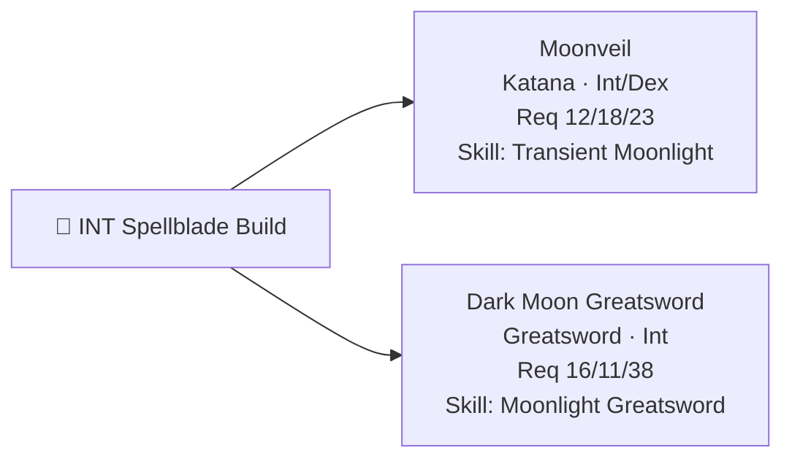
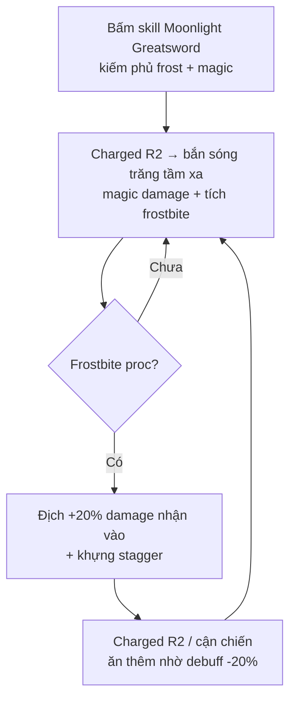

# 🌙 Elden Ring - Build INT Spellblade: Moonveil + Dark Moon Greatsword

> Hướng **Intelligence (phép thuật cận chiến)** - khác hẳn hướng bleed/Dex ở [guide bleed-katana](./elden-ring-bleed-katana-build-guide.md).
> 2 vũ khí biểu tượng: **Moonveil** (katana chém sóng phép) + **Dark Moon Greatsword** (kiếm của Ranni, phủ frost + magic).
> Chỉ số/vị trí đã verify qua wiki (fextralife / game8 / rankedboost).

---

## 1. Định hướng

- **Damage chính = Magic** (phép), scale theo **Intelligence**. Physical chỉ là phần phụ.
- 2 vũ khí bổ trợ: **Moonveil** đánh nhanh/tầm xa, **Dark Moon Greatsword** nặng hơn + thêm **frostbite** (băng giá).
- Build này **cần respec sang INT** (Samurai khởi đầu Int 9) - dùng Larval Tear ở Rennala.

---

## 2. Vũ khí

### Moonveil (katana phép)
- **Yêu cầu:** Str 12 / Dex 18 / **Int 23**. Scale Int (chính) + Dex. Damage **Magic + Physical**.
- **Skill Transient Moonlight:** cúi người rồi chém tung **sóng phép tầm xa** - spam từ xa cực an toàn, staggers tốt, tốn ít FP.
- **Lấy:** drop từ boss **Magma Wyrm Makar** ở **Gael Tunnel** (giữa Limgrave - Caelid), lấy được **khá sớm**.
- Vũ khí **Somber** (+10).

### Dark Moon Greatsword (kiếm của Ranni) ⭐
- **Yêu cầu:** Str 16 / Dex 11 / **Int 38** (cao). Scale +10 thành **Int B**, Str/Dex D. Damage **Physical + Magic**.
- **Skill Moonlight Greatsword:** phủ **frost + magic** lên lưỡi (buff damage phép); **charged R2 bắn sóng trăng tầm xa** + tích **frostbite**. Sau khi buff, **charged R2 phá stance hầu hết boss trong 1-2 đòn**.
- **Lấy:** hoàn thành **questline Ranni** (dài), nhận ở dưới **Cathedral of Manus Celes** sau khi đưa Ranni cái Dark Moon Ring.
- Vũ khí **Somber** (+10).

> Questline Ranni tóm tắt: gặp Ranni (tên Renna) ở Church of Elleh đầu game → Ranni's Rise (sau khi hạ Royal Knight Loretta) → Blaidd/Seluvis/Iji → Nokron lấy Fingerslayer Blade → Nokstella → Lake of Rot → Moonlight Altar → Cathedral of Manus Celes.

---

## 3. Chỉ số (Level ~150, chơi được CẢ 2 vũ khí)

Để cầm cả Moonveil (18 Dex) lẫn Dark Moon Greatsword (16 Str, 38 Int):

| Chỉ số | Điểm | Ghi chú |
|--------|------|---------|
| **VIG** | 55-60 | máu, greatsword hay ăn đòn |
| **MIND** | 25-30 | FP cho spell + skill |
| **END** | 25-30 | stamina (greatsword nặng) + equip load |
| **STR** | 16 | đủ req Dark Moon Greatsword |
| **DEX** | 18 | đủ req Moonveil |
| **INT** | **68-80** | ⭐ trục chính - dồn hết vào đây |

> **INT 68** là mốc đẹp: đủ dùng spell **Ranni's Dark Moon** (debuff -10% kháng phép của địch). Lên **80** thì damage phép max. Dưới 60 thì phí vũ khí.

---

## 4. Loadout (talisman / physick / buff)

### Talisman
| Talisman | Hiệu ứng | Ghi chú |
|----------|----------|---------|
| **Shard of Alexander** | +15% damage **skill** | buff Transient Moonlight + Moonlight Greatsword |
| **Magic Scorpion Charm** | +12% damage phép (nhận thêm dmg) | từ questline Seluvis |
| **Godfrey Icon** | +15% damage **charged** skill/spell | hợp charged R2 sóng trăng |
| **Carian Filigreed Crest** | -25% FP cho skill | spam Transient Moonlight rẻ hơn |

> ⚠️ Lưu ý: **Graven-Mass / Graven-School Talisman** chỉ tăng damage **sorcery (phép niệm bằng gậy)**, **KHÔNG** tăng weapon skill (Transient Moonlight, Moonlight Greatsword). Muốn tận dụng thì phải cầm thêm gậy + niệm phép thật.

### Physick
- **Magic-Shrouding Cracked Tear** (+20% damage phép) - bắt buộc.
- 1 tia phụ: stamina / máu tùy nhu cầu.

### Buff
- **Terra Magica** (tạo vùng +35% damage phép dưới chân - đứng trong đó spam).
- **Golden Vow** (+dmg/+def).

---

## 5. Frostbite - điểm mạnh riêng của Dark Moon Greatsword

**Frostbite** (băng giá) khi proc: địch **+20% damage nhận vào** (mọi loại) + khựng. Combo với **Ranni's Dark Moon** spell (-10% kháng phép) → boss ăn damage phép cực nặng. Đây là lý do build INT + Dark Moon Greatsword bào boss rất nhanh.

---

## 6. Cách đánh

**Moonveil:** đứng **tầm trung/xa**, cúi spam **Transient Moonlight** (sóng phép) - an toàn, staggers. Cận chiến thì R1 nhanh + R2. Bật Terra Magica trước để tăng dmg.

**Dark Moon Greatsword:** bấm **skill Moonlight Greatsword** (phủ frost+magic) → **charged R2 bắn sóng trăng** từ xa (tích frostbite) → khi frost proc thì áp sát **charged R2/R1** ăn damage tăng. Phá stance nhanh → riposte crit.

**Combo 2 vũ khí:** Dark Moon Greatsword mở màn (frost + phá stance), Moonveil dọn dẹp/tầm xa. Cầm thêm 1 gậy (vd Carian Regal Scepter) để niệm **Ranni's Dark Moon** / các phép INT khi cần.

---

## 7. Caveat

- **Boss kháng phép** (một số boss magic-resistant): mang thêm phép vật lý (**Rock Sling**) hoặc đổi sang phần physical - INT build ít bị "counter" hơn holy nhưng vẫn có boss lì phép.
- **Cần respec INT** (Samurai gốc Dex) → tốn Larval Tear. Nếu anh đang đi hướng bleed thì đây là **build thứ 2** (đổi hẳn hướng), không kiêm được cùng lúc với bleed/Arcane.
- Dark Moon Greatsword **cần Int 38** mới cầm được → không dùng sớm được, phải xong questline Ranni.
- **DLC:** cần cày Scadutree; cả 2 là vũ khí base game nên vào DLC hơi hụt so với vũ khí DLC-native (nhưng vẫn mạnh nhờ frost + magic).

---

### Nguồn tham khảo (đã verify)
- Dark Moon Greatsword (Str 16/Dex 11/Int 38, scale Int B, Cathedral of Manus Celes): fextralife, game8, rankedboost
- Moonveil (Str 12/Dex 18/Int 23, Gael Tunnel): fextralife wiki
- Stats INT 68-80, frostbite -20% + Ranni's Dark Moon -10% magic res: cộng đồng r/EldenRingBuilds, gamerant
