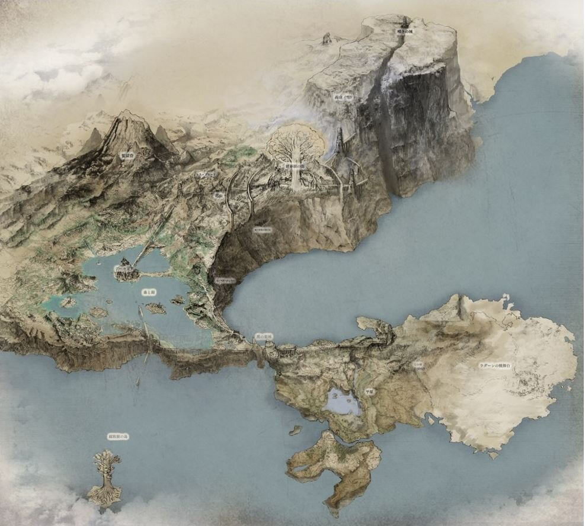
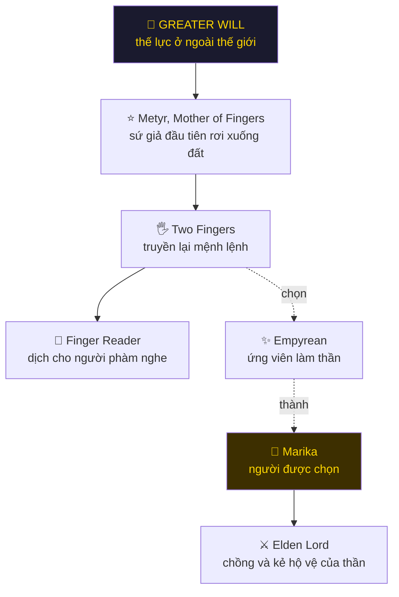
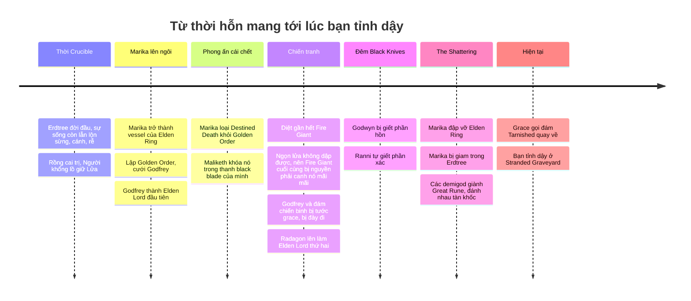
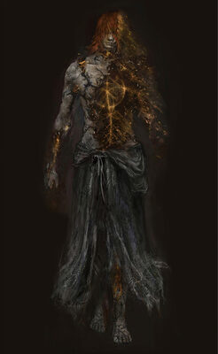
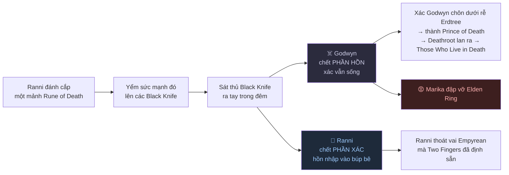
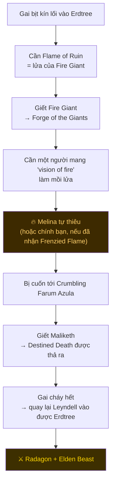
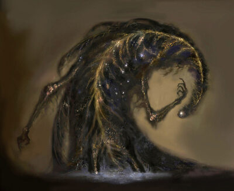

# 🌳 Cốt truyện Elden Ring - Tổng quan

> Elden Ring không kể chuyện thẳng. Nó giấu cốt truyện trong mô tả item, một hai câu thoại NPC, và vài đoạn cutscene ngắn. Đọc hết file này là nắm được bộ khung mà game cố tình không nói ra.
>
> Đọc tiếp: [Gia phả 9 demigod](./02-elden-ring-gia-pha-va-demigod.md) · [Questline NPC và 6 kết thúc](./03-elden-ring-questline-npc-va-ket-thuc.md) · [NPC phụ](./04-elden-ring-npc-phu-va-cau-chuyen-rieng.md) · [DLC Shadow of the Erdtree](./05-elden-ring-shadow-of-the-erdtree.md)

---

## 1. Tóm tắt trong 60 giây

Một vị thần tên **Marika** cai trị vùng đất Lands Between bằng một bộ luật gọi là **Elden Ring**. Một đêm, con trai bà là Godwyn bị ám sát bằng những con dao đen được yểm một mảnh **Rune of Death**, thứ sức mạnh duy nhất có thể chạm tới một demigod. Marika **đập vỡ Elden Ring**, rồi bị trói vào gốc cây thần.

Các mảnh vỡ rơi vào tay đám con cháu bà. Chúng đánh nhau tan nát và không ai thắng. Tệ hơn: **Destined Death đã bị phong ấn từ trước**, nên demigod bị thương tật thì cứ thế mà chịu, còn xác chết dưới rễ cây thì bò dậy. Thế giới không sụp đổ, nó chỉ **kẹt lại và mục dần**.

Bạn là **Tarnished**, hậu duệ của những người bị tước grace và bị đày đi từ lâu, giờ được gọi về để gom lại các mảnh vỡ, hàn Elden Ring, và trở thành **Elden Lord**. Cả game là câu hỏi: hàn lại theo kiểu nào? Hoặc có nên hàn không?

---

## 2. Bốn khái niệm phải nắm trước

Nắm 4 cái này là hiểu được phần lớn mô tả item trong game.

| Khái niệm | Nó thực sự là gì |
|---|---|
| **Elden Ring** | Không phải cái nhẫn. Là một **bộ luật của thực tại**, cấu thành từ nhiều **Rune**. Gỡ một Rune ra là đổi luật. Marika gỡ **Rune of Death** (Destined Death) ra khỏi Golden Order và cho phong ấn nó, và đó là lý do demigod không chết đàng hoàng được. |
| **Erdtree** (cây vàng) | Sinh ra từ Elden Ring, là **biểu tượng và trung tâm** của Golden Order. Cửa vào bị một lớp gai bịt kín, nên phải đốt cây thì mới thiêu được gai. |
| **Greater Will** | Một thế lực ở ngoài thế giới. Nó gửi xuống một **ngôi sao vàng mang theo Elden Beast**, và Elden Beast về sau **trở thành chính Elden Ring**. Đây là ông chủ thật sự đứng sau Golden Order. |
| **Grace** (ánh vàng) | Sự dẫn dắt gắn với Erdtree. Ánh vàng chỉ đường trong game **là cốt truyện**, không phải UI. **Tarnished** là Godfrey, đám chiến binh của ông và con cháu họ, những người bị tước grace và bị đày khỏi Lands Between. Nay grace bừng lại và gọi họ về. |

### Chuỗi mệnh lệnh của Greater Will

> ⚠️ **Cú twist lớn nhất của DLC:** Metyr **đã bị Greater Will bỏ rơi** và không còn nhận được tín hiệu nào nữa. Chi tiết ở [file DLC](./05-elden-ring-shadow-of-the-erdtree.md).

---

## 3. Dòng thời gian

---

## 4. Cú twist trung tâm: Marika chính là Radagon

<table>
<tr>
<td width="50%"></td>
<td width="50%"></td>
</tr>
<tr>
<td align="center"><b>Queen Marika the Eternal</b></td>
<td align="center"><b>Radagon of the Golden Order</b></td>
</tr>
</table>

**Marika và Radagon là một.** Game nói thẳng điều này hai lần:

1. Đứng trước **tượng Radagon** ở Leyndell và đọc phép **Law of Regression** thì hiện ra dòng chữ ẩn: *"Radagon is Marika."*
2. Ở boss cuối, xác Marika biến thành Radagon ngay trước mắt bạn.

Điều đó biến tiểu sử của họ thành một nghịch lý:

- Marika đập vỡ Elden Ring. Radagon thì cầm búa **cố hàn nó lại**.
- Radagon cưới Rennala (có Ranni, Rykard, Radahn), rồi rời bà để về kinh làm chồng Marika, tức là **về với chính mình**.
- Con của "Marika + Radagon" (Malenia, Miquella) ra đời từ **một thực thể duy nhất**.

> 💡 Đây chính là bí mật mà **Goldmask** mất cả questline để lần ra. Cần nói rõ: game xác nhận *"Radagon is Marika"*, nhưng **không** giải thích cơ chế. Họ vốn là một rồi tách ra, hay từng là hai người rồi nhập lại, game để ngỏ.

---

## 5. Night of the Black Knives - đêm mọi thứ vỡ

Đây là sự kiện châm ngòi cho toàn bộ game.

**Vì sao lại là hai kiểu chết ngược nhau?** Không phải vì con dao yếu. Item `Cursemark of Death` nói rõ:

> *"However, two demigods perished at the same time, breaking the cursemark into two half-wheels."*
> *"Ranni was the first of the demigods whose flesh perished, while the Prince of Death perished in soul alone."*

Hai demigod chết **cùng một lúc**, nên dấu nguyền bị xé làm đôi. Godwyn mất hồn mà xác sống. Ranni mất xác mà hồn còn. Hai người là hình ảnh phản chiếu của nhau.

**Ranni được gì?** Là **Empyrean**, Ranni bị định sẵn phải trở thành thần kế nhiệm dưới sự dẫn dắt của Two Fingers. Giết chính thân xác mình là bước đầu tiên để thoát ra. Nhưng nó **chưa cắt đứt hẳn**: Two Fingers vẫn thả Baleful Shadow đi săn cô, và mãi sau này cô mới dùng **Fingerslayer Blade** giết chính Two Fingers của mình.

---

## 6. The Shattering và tại sao thế giới đứng im

Sau khi Marika đập vỡ Elden Ring, các demigod kế thừa **Great Rune** và đánh nhau. Chiến tranh không kết thúc bằng chiến thắng, nó kết thúc bằng **kiệt sức**.

Vấn đề chí mạng: Destined Death đã bị phong ấn từ trước. Không có cái chết định mệnh thì:

- Xác Godwyn dưới rễ Erdtree sinh ra **Deathroot**, lan ra thành **Those Who Live in Death**
- Các demigod không bị hạ gục hẳn, nên chiến tranh không bao giờ ngã ngũ
- Thế giới không tái sinh được, chỉ mục ra

Marika bị giam trong Erdtree. Radagon, tức là chính bà, đã cố sửa Elden Ring và thất bại. Khi bạn tới nơi, cái thân xác chung đó vẫn đang bị treo trong cây.

> ⚠️ Đừng nhầm: Malenia thối rữa, Miquella không lớn, Morgott mang hình Omen. Ba cái đó là **bẩm sinh**, không phải hậu quả của việc phong ấn Destined Death.

---

## 7. Bạn là ai, và tại sao phải đốt cây

Cửa vào Erdtree bị bịt bằng một lớp gai không xuyên qua được. Chuỗi logic của game:

> 🔥 Nhiều người tưởng đốt cây xong là vào luôn. Không phải. Đốt cây xong bạn bị ném sang Farum Azula, và **chính cái chết mà Maliketh thả ra mới là thứ thiêu sạch đám gai**.

**Melina là ai?** Game xác nhận: cô sinh ra dưới gốc Erdtree, mang một nhiệm vụ do **mẹ** giao, và thiếu một thứ cô gọi là *"vision of fire"*.

Chuỗi suy luận mạnh nhất về thân thế cô đến từ DLC: item **Messmer's Kindling** ghi *"Messmer, much like his younger sister, bore a vision of fire"*. Messmer là con Marika, và người "em gái mang vision of fire" gần như chắc chắn là Melina. Game **không gọi tên cô ra** ở đó, nên đây là suy luận rất mạnh chứ chưa phải câu xác nhận thẳng.

Còn giả thuyết Melina là **Gloam-Eyed Queen** thì vẫn chỉ là **giả thuyết cộng đồng**.

---

## 8. Các Outer God - không chỉ có Greater Will

Điểm nhiều người bỏ sót: Greater Will **không phải thế lực duy nhất**. Phần lớn questline lệch chuẩn trong game đều có một thế lực khác giật dây.

| Thế lực | Đại diện ở trần gian | Gắn với cái gì | NPC dính vào |
|---|---|---|---|
| 🌌 **Greater Will** | Two Fingers, Elden Beast, Erdtree | Golden Order | Gideon, Corhyn, Enia |
| 🔥 **Frenzied Flame** | Three Fingers | Nung chảy tất cả trở về **một khối duy nhất**, xoá bỏ sự tồn tại tách rời | Hyetta, Shabriri, Vyke |
| 🩸 **Formless Mother** | Mohg | Vết thương, máu bị nguyền, bloodflame | Mohg, Varré |
| 🦠 **God of Rot** | Malenia, đầm lầy Aeonia | Thối rữa, chết rồi lại đâm chồi | Malenia, Gowry, Millicent |
| 🌙 **Dark Moon** | Ranni, dòng Carian | Trăng lạnh, phép trăng của nhà Carian | Ranni, Rennala, Blaidd |
| 🐦 **Vị thần vô danh của Twinbird** | Deathbird, ghostflame | Cái chết và ngọn lửa ma | Tibia Mariner, các Deathbird |

> ⚠️ Bảng này là **cách cộng đồng gom nhóm**, không phải phân loại chính thức. Game chỉ gọi thẳng vài thực thể là "Outer God", còn mục tiêu của chúng thì phần lớn suy ra từ mong muốn của tín đồ chứ không phải từ lời của chính thực thể đó.
>
> Riêng **Fia, D và Rogier** thì đừng gom vào một phe thần chết nào cả. Fia bảo vệ Those Who Live in Death, D thì đi săn đúng đám đó, còn Rogier chỉ đang điều tra. Ba người liên quan tới **cái chết của Godwyn**, không phải tới một Outer God chung.

---

## 9. Trận cuối thực sự đánh với ai

| Đối thủ | Là ai |
|---|---|
| **Godfrey / Hoarah Loux** | Elden Lord đầu tiên. Con sư tử vàng trên lưng ông tên là **Serosh**, được đặt ở đó để kìm cơn khát chiến đấu của ông. Vào phase 2, Godfrey **cảm ơn Serosh rồi giết nó**, vứt rìu, và đánh tiếp như con người cũ: Hoarah Loux, tù trưởng vùng đất hoang. |
| **Radagon** | Nửa còn lại của Marika. Đã cố hàn cái Ring mà chính mình đập vỡ, và thất bại. |
| **Elden Beast** |  Con thú do Greater Will gửi xuống, được mô tả là **hiện thân sống của khái niệm Order**, và chính nó về sau trở thành Elden Ring. Đánh xong con này thì khó mà không nghĩ rằng cái "trật tự thiêng liêng" kia thực chất là **một sinh vật từ nơi khác tới**. |

---

## 10. Nên đọc tiếp gì

| File | Nội dung |
|---|---|
| [02 - Gia phả và demigod](./02-elden-ring-gia-pha-va-demigod.md) | Ai là con ai, từng demigod bị gì |
| [03 - Questline NPC và 6 ending](./03-elden-ring-questline-npc-va-ket-thuc.md) | Ranni, Fia, Goldmask, Dung Eater, Frenzied Flame dẫn tới ending nào |
| [04 - NPC phụ](./04-elden-ring-npc-phu-va-cau-chuyen-rieng.md) | Millicent, Alexander, Blaidd, Sellen, Patches và phần còn lại |
| [05 - Shadow of the Erdtree](./05-elden-ring-shadow-of-the-erdtree.md) | Nguồn gốc thật của Marika, Messmer, kế hoạch của Miquella |

---

## Nguồn

- [Eldenpedia (eldenring.wiki.gg)](https://eldenring.wiki.gg/) - text item và ảnh
- [Cursemark of Death](https://eldenring.wiki.gg/wiki/Cursemark_of_Death) · [Law of Regression](https://eldenring.wiki.gg/wiki/Law_of_Regression) · [Serosh](https://eldenring.wiki.gg/wiki/Serosh)
- [Elden Ring Wiki - Fextralife](https://eldenring.wiki.fextralife.com/)

Ảnh là concept art và ảnh chụp trong game, bản quyền FromSoftware / Bandai Namco. Dùng cho mục đích tham khảo cá nhân.
