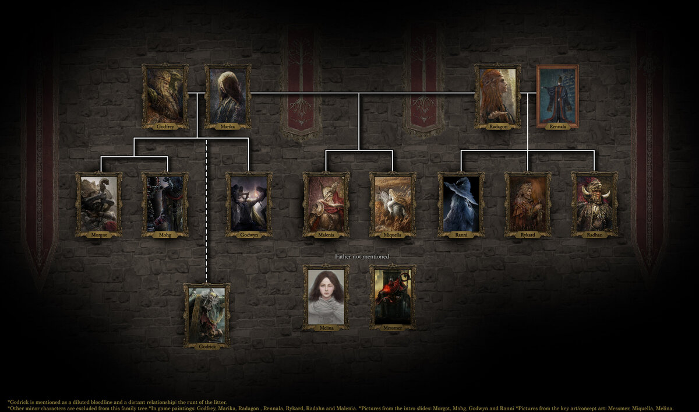
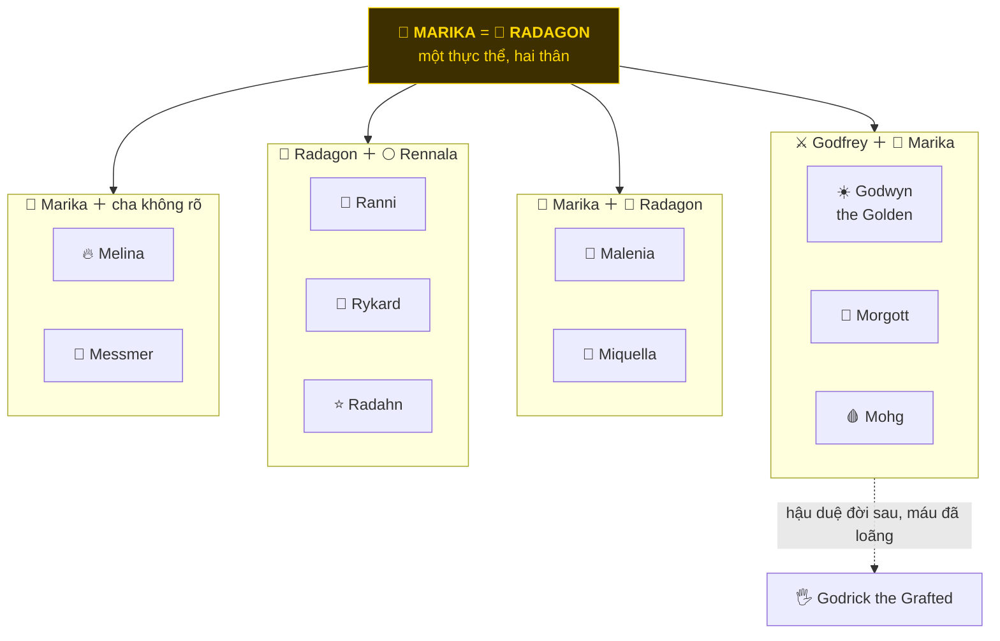
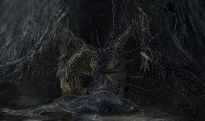
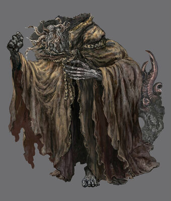
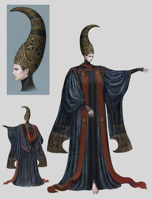
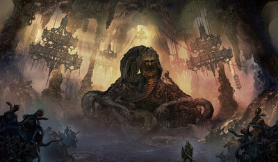
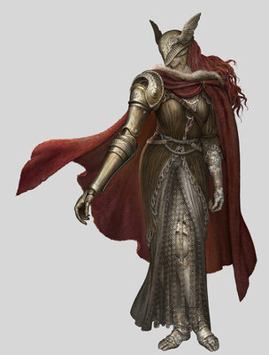
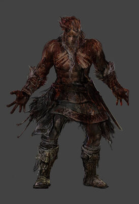
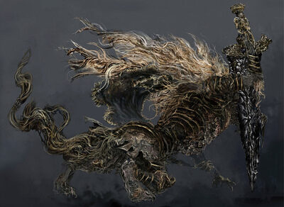

# 👑 Gia phả và các Demigod

> Ai là con ai, ai bị nguyền cái gì, và vì sao mỗi đứa con của Marika đều hỏng theo một kiểu riêng.
>
> Quay lại: [Cốt truyện tổng quan](./01-elden-ring-cot-truyen-tong-quan.md)

---

## 1. Gia phả

Mỗi khung dưới đây là **một cặp cha mẹ** và các con của cặp đó.

**Bốn lưu ý khi đọc gia phả:**

1. Marika và Radagon là **một**. Nên "Marika + Radagon → Malenia, Miquella" nghĩa là hai đứa này ra đời từ một thực thể duy nhất.
2. **Melina và Messmer** là con Marika, nhưng game **không nói cha là ai**. Về Melina, xem chuỗi suy luận ở [file 01](./01-elden-ring-cot-truyen-tong-quan.md#7-bạn-là-ai-và-tại-sao-phải-đốt-cây).
3. **Godrick** thuộc **Golden Lineage**, hậu duệ xa của Godfrey với dòng máu đã loãng. Game gọi thẳng hắn là đứa còi cọc của bầy. Hắn nối qua nhánh nào thì không được xác nhận.
4. **Rennala không phải demigod.** Gideon nói thẳng: *"Rennala herself is no demigod. She is merely the recipient of an amber egg, given to her by Radagon."*

### Ai là Empyrean

**Empyrean** là ứng viên được Two Fingers chọn để có thể thay Marika làm thần. Ranni nói rằng **trong số các demigod đương thời** chỉ có ba người mang danh hiệu đó:

| Empyrean | Shadowbound beast | Kết cục |
|---|---|---|
| 🌙 **Ranni** | **Blaidd** | Tự giết thân xác để thoát vai trò đã định |
| 🌸 **Malenia** | không có cái nào được xác nhận | Bị Scarlet Rot ăn mòn cả đời |
| 🍯 **Miquella** | không có cái nào được xác nhận | Bị nguyền trẻ con vĩnh viễn |

Ngoài ba người này, game còn xác nhận **Marika** và **Gloam-Eyed Queen** cũng là Empyrean. Shadowbound beast của Marika là **Maliketh**.

---

## 2. Bảng tóm tắt nhanh

| Nhân vật | Danh hiệu | Bị gì | Ở đâu |
|---|---|---|---|
| Godwyn | The Golden | Chết hồn, xác sống mãi | Deeproot Depths |
| Morgott | The Omen King | Sinh ra là Omen, bị Golden Order xích dưới hầm | Leyndell |
| Mohg | Lord of Blood | Cùng thân phận Omen, chọn theo đường máu | Mohgwyn Palace |
| Radahn | Starscourge | Scarlet Rot ăn não, chỉ còn bản năng | Caelid |
| Rykard | Lord of Blasphemy | Tự hoà vào rắn, mất luôn hình người | Volcano Manor |
| Ranni | The Witch | Mất thân xác, hồn trong búp bê | Three Sisters |
| Malenia | Blade of Miquella | Scarlet Rot từ lúc lọt lòng | Elphael |
| Miquella | The Unalloyed / of the Haligtree | Trẻ con vĩnh viễn, không lớn được | Haligtree, rồi bị mang đi |
| *Rennala* | Queen of the Full Moon *(không phải demigod)* | Bị Radagon bỏ, tâm trí vỡ vụn | Raya Lucaria |

---

## 3. Từng người một

### ☀️ Godwyn the Golden

Con của Marika và Godfrey, người duy nhất trong nhà làm hoà được với **loài rồng**. Bạn thân của hắn là **Lichdragon Fortissax**.

Đêm Black Knives, hắn **chết phần hồn** trong khi xác vẫn sống. Cái xác bị chôn dưới rễ Erdtree rồi lan ra thành một khối thịt cây khổng lồ ở Deeproot Depths, và từ đó sinh ra **Deathroot**.

Deathroot lan tới đâu thì **Those Who Live in Death** mọc lên tới đó. Hắn là gốc rễ của cả hiện tượng xác sống trong game.

> Game gọi hắn là **demigod đầu tiên chết**. Chuyện hắn là con cả hay đứa được yêu nhất thì phổ biến trong cộng đồng nhưng không có câu nào xác nhận thẳng. Việc Marika đập vỡ Elden Ring xảy ra ngay sau cái chết này, nhưng **động cơ chính xác của bà thì game không nói**.

 

---

### 🐐 Morgott, the Omen King

Sinh đôi với Mohg, cả hai đều là **Omen**: mọc sừng và xương thừa, dấu vết của Crucible thời cổ. Golden Order coi đó là ô uế, nên hai anh em bị xích dưới hầm Leyndell từ nhỏ.

Điều làm Morgott bi kịch: **hắn vẫn trung thành**. Bị chính cái trật tự đó chối bỏ, hắn vẫn lên làm người bảo vệ Erdtree cuối cùng, đội tên giả **Margit the Fell Omen** đi thử thách từng Tarnished một, rồi chết ngay dưới gốc cây không bao giờ nhận hắn.

> Lúc bị hạ, hắn không nói về bản thân. Hắn nói về tất cả mọi người: **"We are all forsaken. None may claim the title of Elden Lord."** Erdtree không chối bỏ riêng hắn. Nó chối bỏ hết.

 

---

### 🩸 Mohg, Lord of Blood

Cùng thân phận với anh trai, nhưng chọn hướng ngược lại hoàn toàn. Mohg quay lưng với Erdtree, bắt tay với **Formless Mother**, và xây một triều đại máu dưới lòng đất ở Mohgwyn Palace.

Kế hoạch của hắn: nâng **Miquella** lên thành thần, rồi **trở thành consort của Miquella** để khai sinh Mohgwyn Dynasty. Đó là lý do hắn mang cái kén vàng đó theo mình.

> Varré, NPC đầu tiên bạn gặp trong game, là người của Mohg đi tuyển mộ. Chi tiết ở [file 03](./03-elden-ring-questline-npc-va-ket-thuc.md).
>
> Và [DLC lật ngược luôn chuyện này](./05-elden-ring-shadow-of-the-erdtree.md): Mohg không hẳn là kẻ chủ mưu.

 

---

### 🌕 Rennala, Queen of the Full Moon

Không phải máu mủ Marika, và **không phải demigod**. Bà là hoàng gia **Carian**, hiệu trưởng học viện phù thuỷ Raya Lucaria.

Radagon cưới bà để chấm dứt chiến tranh giữa Golden Order và Liurnia. Họ có ba con: Radahn, Rykard, Ranni. Rồi Radagon rời bà để về kinh làm chồng Marika, để lại cho bà một **amber egg** chứa Great Rune of the Unborn.

Bà không gượng lại được. Giờ bà ngồi giữa đại sảnh ôm chính quả trứng đó, liên tục làm nghi thức tái sinh lên đám **Juvenile Scholars** quanh mình. Bà gọi chúng là "sweetings", và mỗi lần tái sinh chúng lại quên đi thêm một ít.

 

---

### ⭐ Starscourge Radahn

Được gọi là demigod mạnh nhất. Hắn học **phép trọng lực** vì một lý do rất đáng yêu: hắn to lớn quá, và hắn không muốn bỏ con ngựa nhỏ Leonard mà hắn cưỡi từ bé.

Chiến tích lớn nhất: hắn dùng trọng lực **giữ đứng cả bầu trời sao**. Sao đứng thì định mệnh của giới chiêm tinh và của Ranni cũng đứng theo.

Ở trận Aeonia, Malenia thả Scarlet Rot. Trận đó kết thúc **bất phân thắng bại**. Radahn sống sót nhưng rot ăn hết trí óc. Giờ hắn lang thang ở Caelid, gặm xác, đánh nhau bằng bản năng thuần tuý.

> **Festival of Radahn** là **lời thề giữa hắn và Jerren**: khi ta không còn là ta nữa, hãy dựng một cái chết xứng đáng cho ta. Giết hắn thì trời sao chuyển động trở lại, **một thiên thạch đâm xuống Limgrave** và mở miệng hố dẫn vào Nokron. Questline Ranni bắt đầu từ đó.

 

---

### 🐍 Rykard, Lord of Blasphemy

Kết luận rằng không thể đánh bại thần bằng cách chơi theo luật của thần, nên hắn chọn cách **nuốt chửng luôn cả thần**. Hắn để **God-Devouring Serpent** ăn mình, rồi hoà làm một với nó.

Volcano Manor bên trên là bộ mặt lịch sự: một hội kín tuyển **Recusant** đi săn các Tarnished khác, đặc biệt là những kẻ dính tới Roundtable Hold.

Vợ hắn là **Tanith**. Sau khi bạn giết hắn, bà **ăn cái xác của hắn**, mong hoà vào ông và tiếp tục con đường nuốt chửng các vị thần.

 

---

### 🌙 Ranni the Witch

Empyrean, được Two Fingers chọn để làm thần kế nhiệm. Nhưng làm thần theo cách đó nghĩa là **làm việc dưới sự dẫn dắt của Greater Will suốt đời**.

Nên Ranni làm điều chưa ai dám: đánh cắp mảnh Rune of Death, tự khắc dấu nguyền lên mình, **giết chính thân xác Empyrean của mình**, rồi nhét linh hồn vào một con búp bê.

Việc đó chưa cắt đứt ngay. Two Fingers vẫn thả **Baleful Shadow** đi săn cô, và mãi sau này cô mới dùng **Fingerslayer Blade** giết chính Two Fingers của mình.

Mục tiêu cuối của Ranni không phải phá huỷ trật tự, mà **đem nó đi thật xa**: một trật tự nơi thần không nhìn xuống, nơi con người tự lo lấy đời mình dưới ánh sao lạnh.

 

---

### 🌸 Malenia, Blade of Miquella

Sinh ra đã mang **Scarlet Rot**, thứ mà em trai cô dành cả đời cố chữa mà không được. Cô mất một tay, một chân, và cả đôi mắt vì nó.

Câu *"I have never known defeat"* của cô là sự thật: cô hành quân bất bại, và từng đánh bại **Godrick** tới mức hắn phải quỳ xin tha.

Nhưng trận lớn nhất đời cô lại không phải chiến thắng. Bia đá ghi trận Aeonia với Radahn là **bất phân thắng bại**. Cô thả Scarlet Aeonia, và cái giá là chính cô nở hoa rot lần đầu, tàn phế luôn thân mình. Không thua, cũng không thắng.

Giờ cô nằm ngủ ở Elphael, giữ Haligtree cho em trai đã bị mang đi.

 

---

### 🍯 Miquella the Unalloyed

Empyrean, sinh đôi với Malenia, **bị nguyền mãi mãi là một đứa trẻ**. Hắn cũng có khả năng **ép buộc tình cảm**, khiến người khác yêu quý và đi theo mình.

Hắn rời bỏ Golden Order và trồng **Haligtree**, một nơi trú ẩn cho những kẻ bị ruồng bỏ. Người **Albinauric** coi đó là vùng đất được chọn của họ.

Hắn thất bại trong việc chữa cho chị gái, rồi tự nhốt mình vào một cái kén trên cây để cố lột xác. Mohg cắt lấy cái kén đó và mang đi.

> Hai năng lực trên là hai chuyện riêng. Game **không** nói khả năng mê hoặc là thứ bù lại cho lời nguyền trẻ con.
>
> DLC là câu chuyện về việc Miquella thoát ra và làm gì tiếp theo. Xem [file 05](./05-elden-ring-shadow-of-the-erdtree.md).

 

---

### 🖐 Godrick the Grafted

Hậu duệ xa của Godfrey, dòng máu đã loãng gần hết. Hắn **ghép tay chân kẻ khác lên người mình** để có thêm sức mạnh và giành lại chỗ đứng ở kinh thành.

Đây là boss lớn đầu tiên của bạn, và cũng là hình ảnh thu nhỏ của cả thế giới này: một kẻ tuyệt vọng khâu mảnh vỡ của người khác vào mình để giả vờ mình còn nguyên vẹn.

---

## 4. Hai người không phải demigod nhưng phải biết

<table>
<tr>
<td width="50%" valign="top">

<b>⚔️ Godfrey / Hoarah Loux</b> 
Elden Lord đầu tiên, chồng Marika, tù trưởng của vùng đất hoang. Sau trận thắng cuối cùng, ông và đám chiến binh <b>bị tước grace và bị đày đi</b>. Ông là <b>Tarnished đầu tiên</b>.  
Con sư tử vàng trên lưng ông tên là <b>Serosh</b>, đặt ở đó để kìm cơn khát chiến đấu khi ông thề làm lord. Vào phase 2 của trận đấu, ông <b>cảm ơn Serosh rồi giết nó</b>, vứt rìu đi, và đánh tiếp bằng tay không như con người cũ.

</td>
<td width="50%" valign="top">

<b>🗡 Maliketh, the Black Blade</b> 
Shadowbound beast của Marika. Bà giao cho hắn nhiệm vụ nặng nhất: <b>phong ấn Destined Death trong thanh black blade</b> và ôm nó đi trốn mãi mãi.  
Sau khi một mảnh bị Ranni đánh cắp, hắn <b>khoá luôn cả thanh kiếm vào trong cơ thể mình</b> để không ai lấy được lần nữa. Giết hắn là bạn thả cái chết trở lại thế giới, và chính cái chết đó mới thiêu được đám gai chắn cửa Erdtree.

</td>
</tr>
</table>

---

## Nguồn

- [Eldenpedia (eldenring.wiki.gg)](https://eldenring.wiki.gg/)
- [Queen Rennala](https://eldenring.wiki.gg/wiki/Queen_Rennala) · [Serosh](https://eldenring.wiki.gg/wiki/Serosh) · [Empyreans](https://eldenring.wiki.gg/wiki/Empyreans)
- [Elden Ring Wiki - Fextralife](https://eldenring.wiki.fextralife.com/)

Ảnh: concept art chính thức của FromSoftware / Bandai Namco.
