# 🔀 Questline NPC và 6 kết thúc

> Elden Ring có 6 ending. Mỗi ending là **một câu trả lời khác nhau cho cùng một câu hỏi**: thế giới này hỏng ở đâu, và sửa kiểu gì. Mỗi câu trả lời do một NPC đại diện.
>
> Quay lại: [Cốt truyện tổng quan](./01-elden-ring-cot-truyen-tong-quan.md)
>
> ℹ️ File này giải thích **ý nghĩa**, không phải walkthrough. Các bước chỉ ghi ở mức mốc chính. Muốn làm đúng từng bước thì mở wiki ra làm song song, questline trong game này rất dễ hỏng.

---

## 1. Bản đồ quyết định

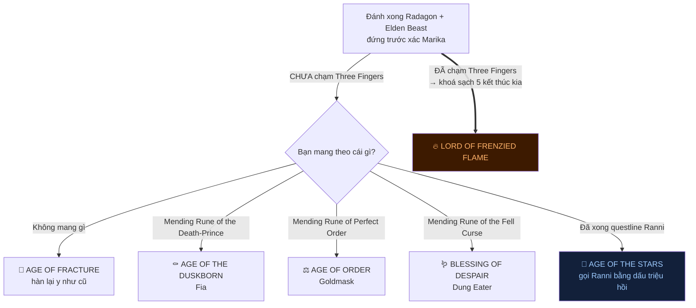

> ⚠️ **Frenzied Flame ghi đè tất cả.** Chạm vào Three Fingers là bạn mất quyền chọn 5 ending kia.
>
> Gỡ được bằng **Miquella's Needle**, dùng ở đấu trường Dragonlord Placidusax. Nhưng lấy cây kim đó khá dài: phải **giúp** Millicent (không phản bội cô), lấy lại Unalloyed Gold Needle, hạ Malenia, rồi quay lại tương tác với bông Scarlet Aeonia.

---

## 2. Sáu ending nói gì

| Ending | NPC | Luận điểm |
|---|---|---|
| 🔘 **Age of Fracture** | Không ai | "Thế giới không hỏng, chỉ vỡ. Ghép lại rồi đi tiếp." Bạn làm Elden Lord, không sửa gì cả. |
| ⚰️ **Age of the Duskborn** | Fia | "Sai lầm là gỡ cái chết đi. Trả nó về, cho người chết được tồn tại bên cạnh người sống." |
| ⚖️ **Age of Order** | Goldmask | "Luật thì đúng, nhưng nó bị **sự thất thường của thần và demigod** làm nhiễu. Sửa cho nó chạy đúng." |
| 🪱 **Blessing of Despair** | Dung Eater | "Trật tự này nuôi sống mình bằng cách nghiền nát kẻ yếu. Vậy thì nguyền rủa hết, cho công bằng." |
| 🌙 **Age of the Stars** | Ranni | "Vấn đề không phải luật nào, mà là **có một vị thần đang nhìn xuống**. Đem trật tự đi thật xa." |
| 🔥 **Lord of Frenzied Flame** | Three Fingers | "Sự tồn tại tách rời chính là cái đau. Nung chảy tất cả trở lại thành một." |

---

## 3. 🌙 Ranni - Age of the Stars

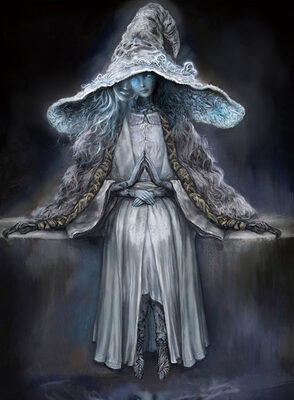

**Ranni muốn gì:** không phải giết thần, mà **đưa trật tự ra khỏi tầm tay thần**. Trong ending của cô, cô mang Elden Ring theo mình ra ngoài không gian lạnh và tối. Loài người ở lại, mất đi sự dẫn dắt của Erdtree, nhưng **từ đó tự quyết định lấy đời mình**.

Cô mô tả nó là một trật tự của **sao và trăng lạnh lẽo, của sự chắc chắn, của sự tách biệt, và của những điều bí mật**. Tức là: thần sẽ ở xa tới mức không can thiệp được nữa.

Đây là ending mà nhiều người coi là "tốt nhất", nhưng nó không hề dịu dàng. Nó là **sự rời đi có chủ đích**.

 

### Các mốc chính

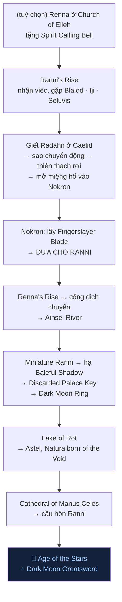

> 💡 **Vì sao phải giết Radahn?** Radahn dùng trọng lực giữ đứng cả bầu trời sao. Sao đứng thì định mệnh đứng, và Ranni không đi tiếp được. Giết hắn thì trời sao chuyển động, một thiên thạch đâm xuống Limgrave, mở đường vào thành phố ngầm Nokron.
>
> ⚠️ Bước hay bị bỏ sót nhất: **phải đưa Fingerslayer Blade cho Ranni**, không phải chỉ nhặt lên. Cổng ở Renna's Rise chỉ mở sau bước đó.

### Ba người quanh Ranni

<table>
<tr>
<td width="33%" valign="top" align="center">
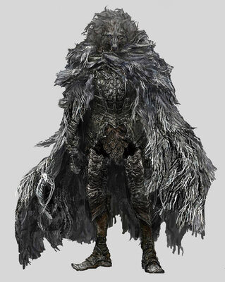 <b>Blaidd</b>

Sói nửa người, <b>shadowbound beast</b> của Ranni, do Two Fingers gán cho cô. Thiết kế của thứ đó là: nếu Empyrean đi chệch, cái bóng sẽ trở thành lời nguyền.  Blaidd <b>không làm thế</b>. Hắn ở lại với Ranni tới cùng, và quanh chỗ hắn còn xác của đám Black Knife Assassin. Nhưng hắn vẫn suy sụp và hoá điên, và bạn phải kết thúc chuyện đó.

</td>
<td width="33%" valign="top" align="center">
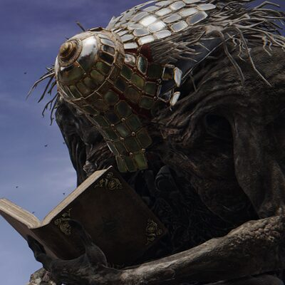 <b>Iji</b>

Thợ rèn khổng lồ, cố vấn già của Ranni, người duy nhất trong nhóm thực sự tử tế và tỉnh táo. Ông biết rõ Seluvis không đáng tin và cảnh báo bạn.

</td>
<td width="33%" valign="top" align="center">
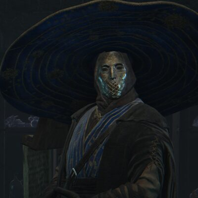 <b>Seluvis</b>

Phù thuỷ làm búp bê. Ngoài mặt là người của Ranni, thật ra hắn thu thập linh hồn để làm con rối, và nhờ bạn <b>chuốc thuốc Nepheli</b> để biến cô thành búp bê. Trong hầm nhà hắn là cả một bộ sưu tập người.

</td>
</tr>
</table>

---

## 4. ⚰️ Fia - Age of the Duskborn

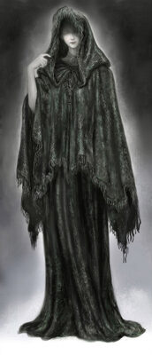

**Fia là gián điệp.** Cô ngồi ở Roundtable Hold ôm ấp các hiệp sĩ, và cái ôm của cô làm họ yếu đi. Cô là người của phe **Those Who Live in Death**, đám xác sống mà Golden Order coi là ô uế phải diệt sạch.

Luận điểm của cô: những người đó không phải quái vật. Họ chỉ **không được chết đàng hoàng**, vì Destined Death đã bị phong ấn. Golden Order tạo ra vấn đề rồi gọi nạn nhân là dị giáo.

Cuối questline, cô xuống Deeproot Depths nằm cạnh xác Godwyn và **cưới một người đã chết**. Bạn bước vào giấc mơ của Godwyn, đánh **Lichdragon Fortissax** (con rồng bạn thân của Godwyn, từng chống lại Death để cứu hắn rồi bị Death ăn mòn), và nhận **Mending Rune of the Death-Prince**.

Ending: cái chết quay lại làm một phần của trật tự. Người sống và người chết cùng tồn tại.

 

**Dây liên quan:** 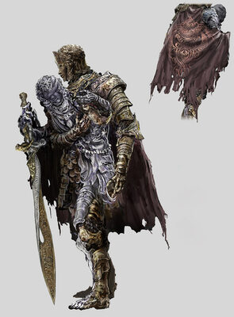 Fia đưa bạn **Weathered Dagger** để **trả lại cho chủ cũ của nó là D, Hunter of the Dead**, người đang đi săn đúng cái đám mà cô bảo vệ. D bị giết ở Roundtable, và người anh em song sinh của hắn có thể xuất hiện sau đó để trả thù. Còn 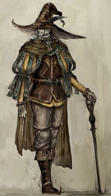 **Rogier** thì đang điều tra cái chết của Godwyn và bị lời nguyền Black Knife ăn dần cơ thể. Ba người này chung một sợi dây: **bí mật về cái chết của Godwyn**.

 

---

## 5. ⚖️ Goldmask - Age of Order

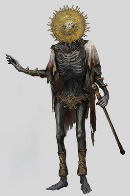

Goldmask **không nói một câu nào trong cả game**. Ông chỉ đứng bất động, tay chỉ trời, suy luận. Brother Corhyn đi theo phiên dịch giúp.

Điều ông lần ra chính là cú twist trung tâm: **Radagon chính là Marika**. Chính bạn là người mang bí mật đó tới cho ông, sau khi đọc Law of Regression trước tượng Radagon ở Leyndell.

Mô tả của **Mending Rune of Perfect Order** nói rằng trật tự bị **sự thất thường của thần và các demigod** làm nhiễu. Ending của ông là sửa cái đó: một Golden Order chạy đúng luật, không bị ý muốn thất thường của ai bẻ cong.

Sau khi Leyndell thành Ashen Capital, bạn tìm thấy **thi thể ông** và nhặt viên rune ở đó.

 

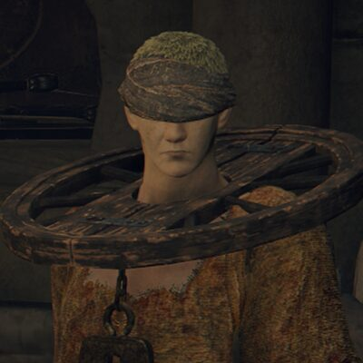 **Brother Corhyn** là mặt còn lại của câu chuyện: một tu sĩ mộ đạo cả đời, đi theo Goldmask vì tin ông sẽ chứng minh Golden Order là đúng. Ông ấy không chịu nổi thứ mà cuộc điều tra đó lôi ra.

 

---

## 6. 🪱 Dung Eater - Blessing of Despair

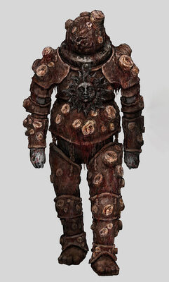

Ending kinh khủng nhất, nhưng lý lẽ thì không hề vô lý.

Dung Eater bị nhốt dưới **Subterranean Shunning-Grounds**, hệ thống cống ngầm dưới Leyndell, nơi Golden Order vứt mọi thứ nó không muốn nhìn: Omen, người dị dạng, kẻ nghèo. Hắn là **sản phẩm do chính cái trật tự đó tạo ra rồi giấu đi**.

Hắn muốn nguyền rủa mọi linh hồn bằng **Seedbed Curse**, để khi chết không ai được trở về với Erdtree, tất cả cùng thối rữa như nhau. Nói cách khác: nếu sự cứu rỗi chỉ dành cho một số người, thì **xoá bỏ sự cứu rỗi luôn cho công bằng**.

Bạn đưa hắn 5 Seedbed Curse để đổi lấy **Mending Rune of the Fell Curse**.

 

---

## 7. 🔥 Frenzied Flame - Lord of Frenzied Flame

<table>
<tr>
<td width="50%" valign="top" align="center">
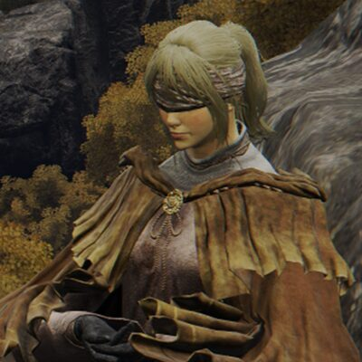 <b>Hyetta</b>
</td>
<td width="50%" valign="top" align="center">
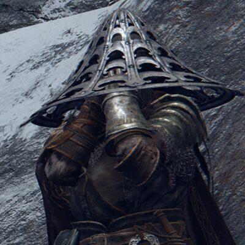 <b>Shabriri</b>
</td>
</tr>
</table>

**Three Fingers** là sứ giả của **Frenzied Flame**, thế lực đối lập hoàn toàn với Greater Will. Nó bị nhốt ngay dưới lòng Leyndell, ngay bên dưới cái trật tự nó muốn thiêu rụi.

Luận điểm của nó: **cái đau đến từ việc tồn tại tách rời nhau**. Có "tôi" và "anh" thì có mất mát, có chia ly, có chết chóc. Giải pháp: nung chảy tất cả trở lại thành một khối duy nhất, không còn ai riêng lẻ để mà đau.

**Đường dẫn tới:**

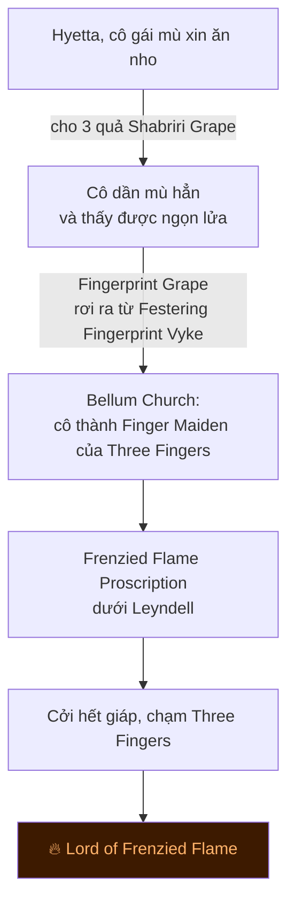

> ⚠️ Chú ý hai điểm hay bị kể sai:
> - Quả nho cuối **không phải Shabriri đưa**. Đó là **Fingerprint Grape** rơi ra từ **Vyke**.
> - **Shabriri Grape** chỉ trùng tên với Shabriri. Ba quả đầu nhặt ở Stormveil, Purified Ruins, và từ Edgar the Revenger.

**Shabriri** được mô tả là **kẻ dối trá tồi tệ nhất lịch sử**, bị moi mắt và bị nguyền vì tội vu khống. Hắn không có thân xác, nên hắn chiếm xác **Yura** để tiếp tục dụ người khác vào ngọn lửa. Gặp hắn ở Mountaintops là bước **tuỳ chọn**, không bắt buộc để tới Three Fingers.

**Vyke** là bản xem trước số phận của bạn: một Tarnished từng gần thành Elden Lord, đã chạm vào ngọn lửa này trước, và giờ chỉ còn là một cái xác cháy đi lang thang.

---

## 8. 🩸 Nhánh Varré và Mohg (không phải ending, nhưng liên quan)

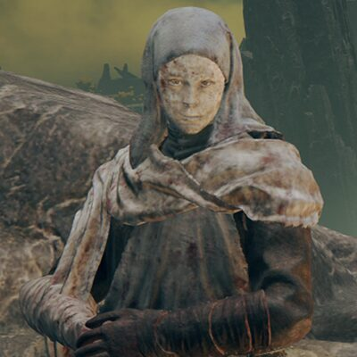

**White Mask Varré** là NPC đầu tiên bạn gặp trong game, và hắn là người của Mohg đi tuyển mộ.

Hắn quan sát bạn, thấy bạn không có Finger Maiden, rồi mời bạn sang phe khác. Các bước:

1. Theo hắn tới **Rose Church**
2. Làm xong **thử thách xâm nhập** của hắn (xâm nhập người chơi khác ba lần, hoặc đánh Magnus the Beast Claw)
3. Nhận **Lord of Blood's Favor**, đem nhúng vào máu một Finger Maiden đã chết
4. Quay lại nói chuyện để nhận **Pureblood Knight's Medal**, thẻ đi thẳng tới **Mohgwyn Palace**

Nhánh này đưa bạn tới Mohg rất sớm. Nhưng muốn **vào DLC** thì vẫn phải hạ **cả Mohg lẫn Radahn**, rồi mới tương tác được với cái kén của Miquella.

Hắn cũng cho thấy một điều: từ phút đầu tiên của game, đã có nhiều thế lực nhắm vào bạn chứ không riêng gì Greater Will.

 

---

## 9. Bảng đối chiếu nhanh

| Ending | Vật cần | Lấy từ đâu | Có thể lỡ không |
|---|---|---|---|
| Age of Fracture | không cần | mặc định | Không |
| Age of the Duskborn | Mending Rune of the Death-Prince | Fia → đánh Lichdragon Fortissax | Có |
| Age of Order | Mending Rune of Perfect Order | thi thể Goldmask ở Ashen Capital | Có |
| Blessing of Despair | Mending Rune of the Fell Curse | Dung Eater, đổi 5 Seedbed Curse | Có |
| Age of the Stars | xong questline Ranni | dấu triệu hồi ở màn cuối | Có |
| Lord of Frenzied Flame | chạm Three Fingers | dưới Leyndell | Khoá hết ending khác |

---

## Nguồn

- [Endings - Eldenpedia](https://eldenring.wiki.gg/wiki/Endings)
- [Ranni the Witch](https://eldenring.wiki.gg/wiki/Ranni_the_Witch) · [Fia](https://eldenring.wiki.gg/wiki/Fia,_Deathbed_Companion) · [Lightseeker Hyetta](https://eldenring.wiki.gg/wiki/Lightseeker_Hyetta) · [Weathered Dagger](https://eldenring.wiki.gg/wiki/Weathered_Dagger)

Ảnh: concept art và ảnh chụp trong game, FromSoftware / Bandai Namco.
