# 🎭 NPC phụ và câu chuyện riêng

> Phần hay nhất của Elden Ring nằm ở đây. Không ai trong số này ảnh hưởng tới ending, nhưng gần như ai cũng có một câu chuyện gọn gàng và buồn.
>
> Quay lại: [Cốt truyện tổng quan](./01-elden-ring-cot-truyen-tong-quan.md) · [Questline và ending](./03-elden-ring-questline-npc-va-ket-thuc.md)

---

## 1. 🦠 Nhánh Scarlet Rot

<table>
<tr>
<td width="130" align="center">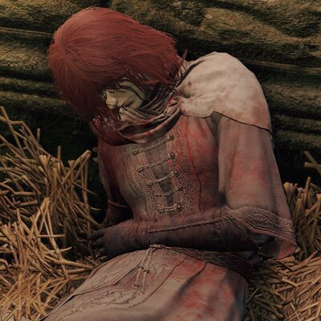 <b>Millicent</b></td>
<td>Cô mang dòng máu Malenia, nhưng chính cô cũng không biết mình là gì. Cô nói: <i>"I am of Malenia's blood. But in what capacity I know not. I could be sister, daughter, or an offshoot…"</i>  Gowry tìm thấy cô và <b>bốn người chị em</b> khi họ còn là trẻ sơ sinh ở đầm lầy Aeonia, rồi nuôi họ lớn. Ý đồ của ông: biến Millicent thành một <b>Malenia thứ hai</b>, một nữ thần thối rữa mới, và sự phản bội chính là thứ làm nụ hoa đó nở đẹp nhất.  Cả questline xoay quanh việc Millicent sẽ tự quyết đời mình hay bị biến thành thứ người khác muốn. Nếu bạn <b>giúp</b> cô ở Haligtree thay vì phản bội, cô rút cây kim ra và chọn <b>mục nát thành hư vô</b> chứ không chịu bị biến thành một kẻ khác.  Đó là một trong số ít nhân vật trong game giành được quyền tự quyết. Và cây kim đó, sau khi bạn giết Malenia, thành <b>Miquella's Needle</b> - thứ duy nhất gỡ được Frenzied Flame.</td>
</tr>
<tr>
<td align="center">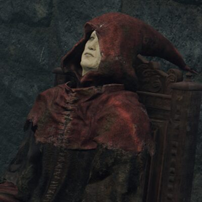 <b>Gowry</b></td>
<td>Ông già tốt bụng chữa bệnh cho Millicent. Thực chất ông <b>không phải người</b>, mà là kẻ phụng sự God of Rot, và toàn bộ sự chăm sóc đó chỉ là ươm một vị thần mới. Sau khi ông "chết", quay lại cửa hàng của ông thì thấy thứ đang ngồi ở đó không còn giả vờ nữa.</td>
</tr>
</table>

---

## 2. ⚔️ Những kẻ đi tìm một chỗ đứng

<table>
<tr>
<td width="130" align="center">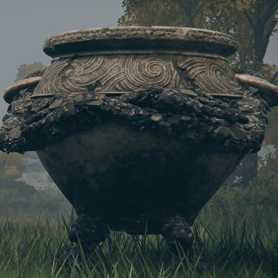 <b>Alexander</b></td>
<td>Cái lọ biết đi, muốn thành chiến binh vĩ đại. Bạn gặp hắn lần đầu khi hắn <b>bị kẹt ngược đầu dưới đất</b> và phải đá cho hắn bật ra. Hắn xuất hiện lại ở lễ hội Radahn, ở Gelmir, và cuối cùng ở Farum Azula hắn xin bạn một trận đấu tay đôi tử tế.  Hắn là NPC vui nhất game, và cũng là NPC hiếm hoi <b>đạt được đúng thứ mình muốn</b>: chết trong một trận đấu ngang tài với một chiến binh mà hắn nể trọng.</td>
</tr>
<tr>
<td align="center">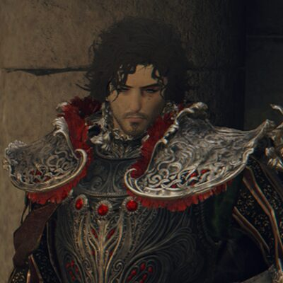 <b>Diallos</b></td>
<td>Quý tộc nhà Hoslow, đi tìm người hầu Lanya đã mất tích. Hắn không tìm được, và cả questline là hắn <b>sụp đổ dần</b>: từ một cậu ấm khoác lác thành một người đàn ông không biết mình sống để làm gì.  Hắn kết thúc ở Jarburg, một ngôi làng của mấy cái lọ biết nói, và chết ở đó khi đánh lại bọn săn trộm. Lần đầu tiên trong đời hắn làm một việc có ý nghĩa, và không ai chứng kiến ngoài một đứa trẻ lọ.</td>
</tr>
<tr>
<td align="center">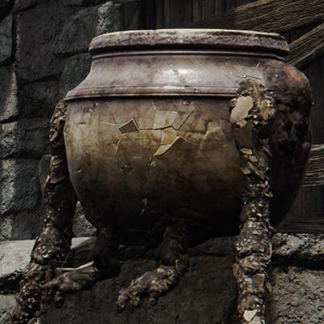 <b>Jar-Bairn</b></td>
<td>Cái lọ con ở Jarburg, thừa hưởng cả di sản của Diallos lẫn của Alexander. Nếu bạn dẫn dắt nó tử tế, nó lớn lên thành người giữ làng.</td>
</tr>
<tr>
<td align="center">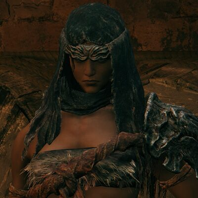 <b>Nepheli Loux</b></td>
<td>Nữ chiến binh, mang họ <b>Loux</b> - cùng họ với Hoarah Loux, tức Godfrey. Game ám chỉ mạnh rằng cô là con gái ông, nhưng chưa bao giờ nói thẳng ra.  Với Kenneth Haight và Gostoc, cô có thể trở thành lãnh chúa mới của Stormveil. Cẩn thận: <b>Seluvis muốn bạn chuốc thuốc cô</b> để biến cô thành búp bê.</td>
</tr>
<tr>
<td align="center">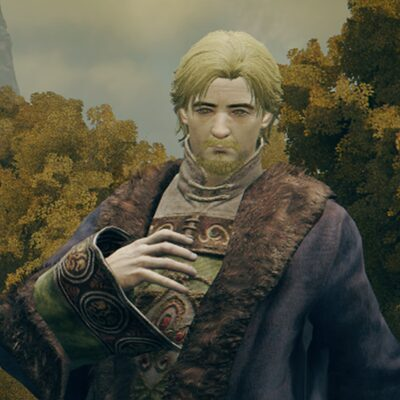 <b>Kenneth Haight</b></td>
<td>Tự xưng là người thừa kế chính danh của Limgrave, đứng trên một tảng đá tuyên bố như vậy giữa lúc chẳng có ai nghe. Cuối cùng ông chấp nhận rằng mình không phải người dẫn dắt, và đi phò tá Nepheli. Một sự khiêm nhường hiếm gặp trong game này.</td>
</tr>
<tr>
<td align="center">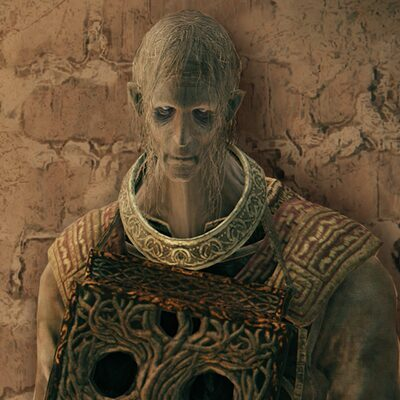 <b>Gostoc</b></td>
<td>Gã gác cổng Stormveil, <b>ăn cắp rune của bạn mỗi lần bạn chết</b> trong lâu đài. Hắn hèn, tham, và nói dối. Nhưng hắn ở lại lâu đài đó cả đời dưới trướng Godrick, kẻ hắn căm ghét, và cái ăn cắp vặt là toàn bộ sự phản kháng mà hắn dám làm.</td>
</tr>
</table>

---

## 3. 🔮 Phù thuỷ Raya Lucaria

<table>
<tr>
<td width="130" align="center">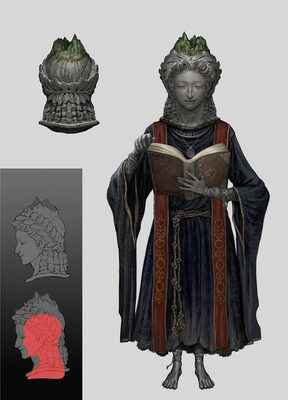 <b>Sellen</b></td>
<td>Phù thuỷ dạy bạn phép đầu game. Cô bị Học viện coi là dị giáo vì theo đuổi <b>primeval sorcery</b>, thứ phép nhìn thẳng vào dòng chảy nguyên thuỷ của vũ trụ. Thân xác thật của cô bị niêm phong trong Witchbane Ruins; cái bạn nói chuyện chỉ là một hình chiếu.  Cuối questline cô định <b>chiếm lấy thân xác Rennala</b>. Bạn chọn: giúp cô, hay giúp Jerren ngăn cô lại.</td>
</tr>
<tr>
<td align="center">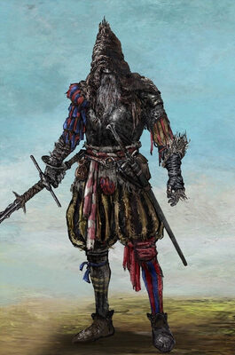 <b>Jerren</b></td>
<td>Người tổ chức lễ hội Radahn, đồng thời là kẻ được giao canh giữ Sellen. Ông chính là người đã thề với Radahn sẽ dựng cho hắn một cái chết xứng đáng, và ông giữ lời.</td>
</tr>
<tr>
<td align="center">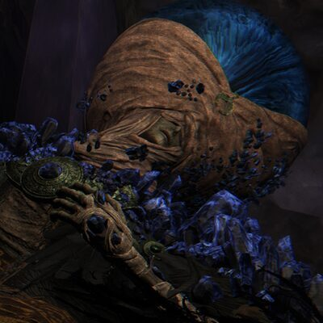 <b>Lusat</b></td>
<td rowspan="2">Hai bậc thầy primeval sorcery, thầy của Sellen. Cả hai <b>nhìn quá sâu vào dòng chảy nguyên thuỷ</b> và không quay lại được. Giờ họ ngồi bất động, người phủ đầy tinh thể. Phép của họ mạnh khủng khiếp nhưng ngốn FP kinh hoàng, đúng như cái giá họ đã trả.</td>
</tr>
<tr>
<td align="center">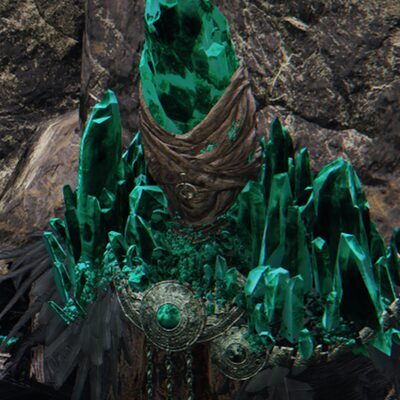 <b>Azur</b></td>
</tr>
<tr>
<td align="center">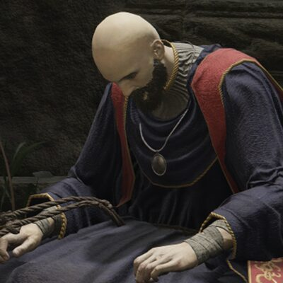 <b>Thops</b></td>
<td>Phù thuỷ nghèo không có chìa vào Học viện, ngồi dạy phép cơ bản kiếm sống. Bạn có thể cho ông <b>Academy Glintstone Key</b>. Ông vào được. Rồi bạn tìm thấy xác ông ở trong đó. Cả đời chỉ mong bước qua một cánh cửa, và cánh cửa đó giết ông.</td>
</tr>
</table>

---

## 4. 🌋 Volcano Manor

<table>
<tr>
<td width="130" align="center">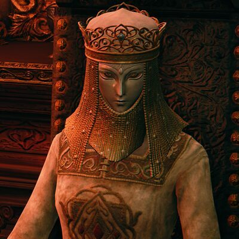 <b>Tanith</b></td>
<td>Vợ của Rykard, chủ nhà Volcano Manor. Bà tuyển bạn làm Recusant đi săn các Tarnished khác. Sau khi bạn giết Rykard, bà <b>không hề trả thù</b>. Bà ngồi xuống cạnh xác chồng và bắt đầu <b>ăn ông ấy</b>, mong hoà vào ông và tiếp tục con đường nuốt chửng các vị thần.</td>
</tr>
<tr>
<td align="center">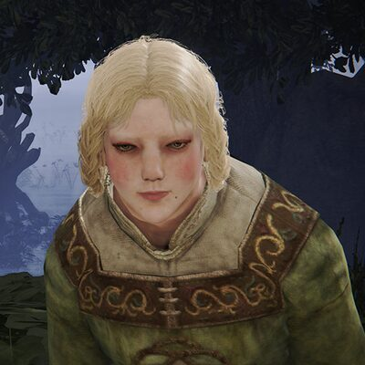 <b>Rya</b></td>
<td>Cô gái nhờ bạn tìm lại chiếc vòng cổ bị mất, người của Tanith. Sự thật: cô là <b>người rắn</b>, và cái vòng cổ chỉ là thứ giữ cho cô giữ được hình người.</td>
</tr>
<tr>
<td align="center">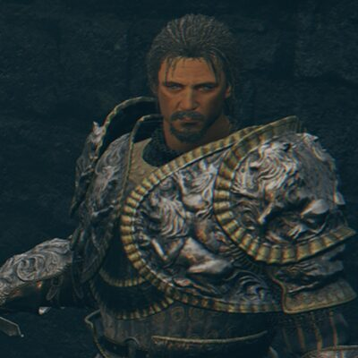 <b>Bernahl</b></td>
<td>Hiệp sĩ dạy bạn Ash of War ở Warmaster's Shack, thực chất là <b>Recusant</b> của Volcano Manor. Ông từng thề trung thành với Golden Order rồi quay lưng. Ở Farum Azula ông xuất hiện lần cuối để đánh bạn, không phải vì thù, mà vì đó là điều duy nhất còn lại mà ông biết làm.</td>
</tr>
</table>

---

## 5. 🏛 Roundtable Hold

<table>
<tr>
<td width="130" align="center">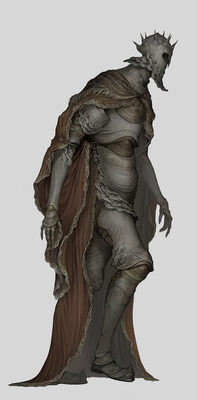 <b>Gideon Ofnir</b></td>
<td>"The All-Knowing". Gideon biết quá nhiều, và chính những điều đó làm ông sụp đổ. Vì <b>biết hết</b> nên ông biết luôn rằng không ai đủ tư cách làm Elden Lord, kể cả mình. Ở Leyndell cuối game ông đánh bạn trong trạng thái vỡ vụn, vừa đánh vừa liệt kê từng demigod bạn đã giết.</td>
</tr>
<tr>
<td align="center">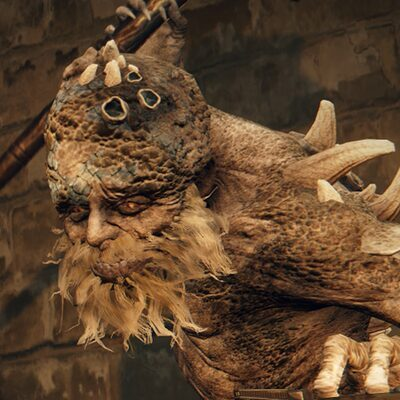 <b>Hewg</b></td>
<td rowspan="2">Cặp NPC chữa lành cho nhau. Hewg là <b>tù nhân</b>. Chính <b>Queen Marika</b> giam ông ở Roundtable với một nhiệm vụ: rèn ra thứ vũ khí đủ sức <b>giết một vị thần</b>. Ông nói thẳng: <i>"Use my masterpiece to slay a god. That is all that I have lived for. And my promise to Q-queen Marika."</i>  Đọc kỹ câu đó thì lạnh người: <b>chính vị thần đó là người đặt hàng.</b>  Roderika là cô bé sống sót duy nhất của một đoàn người chết sạch ở Stormhill, tê liệt vì mặc cảm. Chính Hewg là người đẩy cô đứng dậy làm Spirit Tuner. Ông không tự cứu được mình nhưng cứu được cô.</td>
</tr>
<tr>
<td align="center">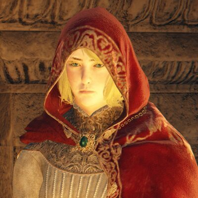 <b>Roderika</b></td>
</tr>
<tr>
<td align="center">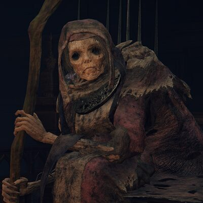 <b>Enia</b></td>
<td>Finger Reader ở Roundtable, người đổi Great Rune cho bạn. Thoại của bà là một trong những nguồn tốt nhất để hiểu Two Fingers hoạt động ra sao, và càng về sau giọng bà càng lộ ra rằng chính bà cũng không chắc về những gì mình đang phiên dịch.</td>
</tr>
<tr>
<td align="center">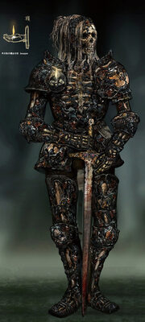 <b>Ensha</b></td>
<td>Bóng người im lặng ngồi cạnh Gideon, tấn công bạn không báo trước. Bộ giáp <b>Royal Remains</b> của hắn làm từ xương của <i>"an ancient lord - the soulless king"</i>.  Game không nói đó là xương ai. Nhưng trong cả thế giới này chỉ có <b>đúng một người bị giết mất linh hồn mà xác vẫn còn</b>, nên rất nhiều người đọc "soulless king" là <b>Godwyn</b>. Đây là suy luận, không phải điều game xác nhận.</td>
</tr>
</table>

---

## 6. 🗡 Săn người và bị săn

<table>
<tr>
<td width="130" align="center">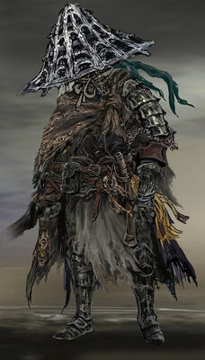 <b>Yura</b></td>
<td>Thợ săn Bloody Finger đến từ Land of Reeds, giúp bạn đánh lại đám xâm nhập máu. Ông bị <b>Eleonora</b> giết. Rồi <b>Shabriri chiếm lấy xác ông</b> và dùng khuôn mặt ông để dụ bạn vào Frenzied Flame. Ông đi săn kẻ xấu cả đời, rồi chính thân xác ông thành công cụ của kẻ xấu.</td>
</tr>
<tr>
<td align="center">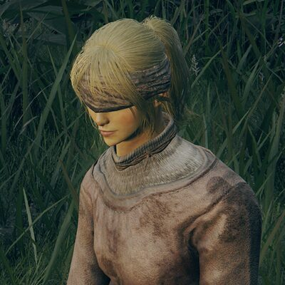 <b>Irina</b></td>
<td rowspan="2">Irina nhờ bạn mang thư cho cha là Edgar ở Castle Morne, đang chống lại cuộc nổi loạn của đám Misbegotten. Bạn mang thư đi, quay lại thì cô đã chết.  Edgar nghe tin. Ông đi giết cả lâu đài, rồi thành <b>Bloody Finger Edgar</b> và đi xâm nhập người khác. Bi kịch: cuộc nổi loạn ở Castle Morne <b>không hề vô cớ</b>, đám Misbegotten bị đối xử như súc vật.</td>
</tr>
<tr>
<td align="center">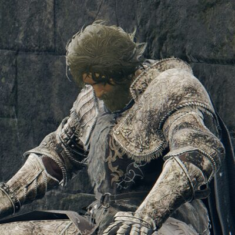 <b>Edgar</b></td>
</tr>
<tr>
<td align="center">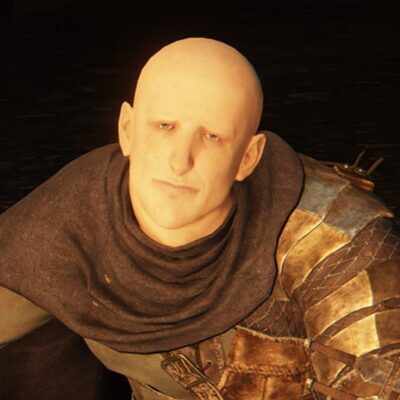 <b>Patches</b></td>
<td>Nhân vật kinh điển xuyên suốt các game FromSoftware. Hắn phục kích bạn trong hang, thua, quỳ xin tha, rồi mở cửa hàng như chưa có gì xảy ra. Hắn phản bội bạn thêm vài lần nữa. Hắn cũng là một trong số ít NPC <b>sống sót tới cuối</b>, vì hắn không tin vào bất cứ lý tưởng nào cả.</td>
</tr>
<tr>
<td align="center">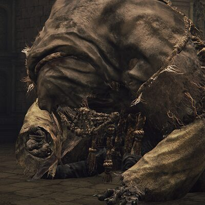 <b>Gurranq</b></td>
<td>"Beast Clergyman" ở Bestial Sanctum, đòi bạn mang <b>Deathroot</b> tới cho ăn. Càng ăn hắn càng mất trí và có lúc quay ra tấn công bạn.  Sự thật: hắn chính là <b>Maliketh</b>. Deathroot mọc ra từ xác Godwyn, nên hắn đang cố ăn cho hết cái chết đang rò rỉ ra thế giới. Đó vẫn là nhiệm vụ Marika giao, chỉ là hắn đã làm nó tới mức thành ra như vậy.</td>
</tr>
</table>

---

## 7. 🕊 Những người tử tế

<table>
<tr>
<td width="130" align="center">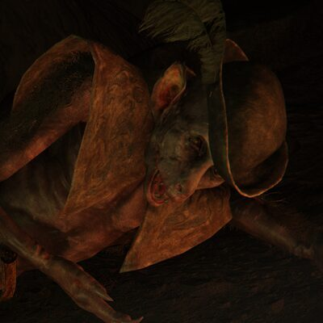 <b>Boc</b></td>
<td>Demi-human biết may vá, bị chính đồng loại đuổi đi. Cậu chỉ ước một điều: <b>được sinh ra lại cho đẹp đẽ</b>. Nếu bạn cho cậu Larval Tear, cậu sẽ dùng nó để đổi hình dạng.  Nhưng có một lựa chọn khác: dùng Prattling Pate <b>"You're Beautiful"</b> để nói với cậu rằng cậu vốn đã ổn rồi. Cậu tin. Đây là một trong vài khoảnh khắc ấm áp thật sự của game.</td>
</tr>
<tr>
<td align="center">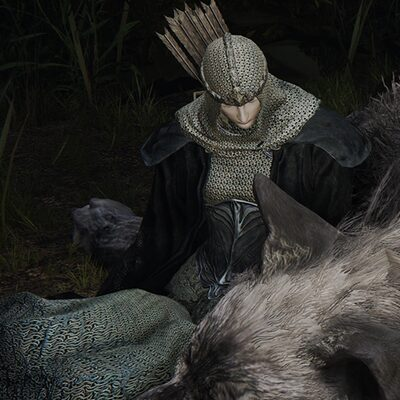 <b>Latenna</b></td>
<td>Albinauric chỉ còn nửa thân, không đi lại được, cùng con sói Lobo. Cô nhờ bạn mang cô tới <b>Apostate Derelict</b> ở Consecrated Snowfield để về với đồng bào. Đám Albinauric là dân bị Golden Order săn giết và coi Haligtree của Miquella là vùng đất được chọn của họ.</td>
</tr>
<tr>
<td align="center">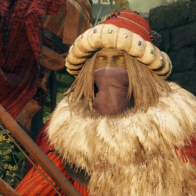 <b>Kalé</b></td>
<td>Thương nhân đầu tiên bạn gặp. Đám Nomadic Merchant là hậu duệ của <b>Great Caravan</b>, một dân tộc bị Golden Order đàn áp và nguyền rủa. Đó là lý do họ ngồi rải rác khắp bản đồ, hát một bài hát buồn, và không ai trong số họ được vào thành.</td>
</tr>
<tr>
<td align="center">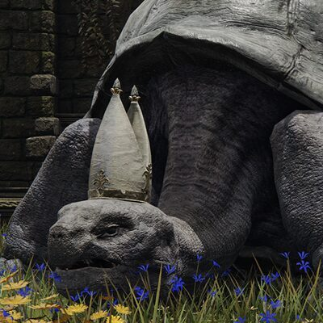 <b>Miriel</b></td>
<td>Con rùa khổng lồ đội mũ giáo hoàng ở Church of Vows. Ông dạy cả phép phù thuỷ lẫn phép thần thánh cho bất cứ ai, kể cả kẻ bị coi là dị giáo, và <b>xoá tội</b> cho bạn khi bạn lỡ giết NPC. Trong một thế giới mà ai cũng bắt bạn chọn phe, ông không bắt.</td>
</tr>
<tr>
<td align="center">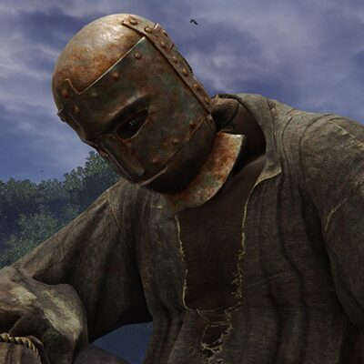 <b>Boggart</b></td>
<td>Bán tôm nướng ở gầm cầu, gọi bạn là "bạn hiền", và cho không nếu bạn hết tiền. Không âm mưu, không phản bội. Chỉ là một người tốt trong một thế giới không dành cho người tốt.</td>
</tr>
</table>

---

## 8. 🔥 Melina

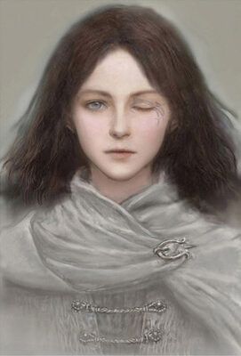

Người đồng hành duy nhất của bạn gần như suốt cả game. Cô cho bạn Torrent, cho bạn khả năng lên cấp, và không đòi hỏi gì.

Những gì game nói thẳng:

- Cô **sinh ra dưới gốc Erdtree** và mang một nhiệm vụ do **mẹ** giao
- Cô thiếu một thứ mà cô gọi là **"vision of fire"**

Từ đó suy ra thân thế cô cần hai bước. Item **Messmer's Kindling** trong DLC viết: *"Messmer, much like his younger sister, bore a vision of fire."* Messmer là con Marika, và người "em gái mang vision of fire" gần như chắc chắn là Melina. Vậy Melina là **con gái Marika, em gái Messmer**. Nhưng game **không gọi tên cô ra** ở câu đó, nên đây là suy luận rất mạnh chứ chưa phải câu xác nhận.

Còn giả thuyết cô là **Gloam-Eyed Queen** thì đến giờ vẫn chỉ là **giả thuyết cộng đồng**. Bằng chứng hay được nêu là cảnh sau ending Frenzied Flame, khi cô mở con mắt trái và thề mang **Destined Death** đến cho bạn. Game chưa bao giờ xác nhận.

 

---

## Nguồn

- [NPCs - Eldenpedia (eldenring.wiki.gg)](https://eldenring.wiki.gg/wiki/NPCs)
- [Millicent](https://eldenring.wiki.gg/wiki/Millicent) · [Smithing Master Hewg](https://eldenring.wiki.gg/wiki/Smithing_Master_Hewg) · [Royal Remains Helm](https://eldenring.wiki.gg/wiki/Royal_Remains_Helm)
- [Elden Ring Wiki - Fextralife](https://eldenring.wiki.fextralife.com/NPCs)

Ảnh: concept art và ảnh chụp trong game, FromSoftware / Bandai Namco.
