# 🌑 Shadow of the Erdtree - DLC

> ⚠️ **Spoiler nặng.** File này tiết lộ nguồn gốc thật của Marika và kết cục của Miquella.
>
> DLC không mở rộng câu chuyện. Nó **lật ngược** câu chuyện: hoá ra Marika không phải nạn nhân, và Miquella không phải người tốt.
>
> Quay lại: [Cốt truyện tổng quan](./01-elden-ring-cot-truyen-tong-quan.md)
>
> Đọc tiếp: [Questline NPC trong DLC](./06-shadow-of-the-erdtree-questline-npc.md) - các bước, màn chọn phe của Leda và trận Enir-Ilim

---

## 1. Land of Shadow là gì

Một vùng đất **bị che khuất khỏi Lands Between** dưới cái bóng của Erdtree, tách hẳn khỏi phần còn lại của thế giới và khỏi lịch sử.

Đây là **quê nhà của Marika**, và cũng là nơi bà giấu đi dấu vết của cuộc thanh trừng mà bà đã ra lệnh.

Bạn vào được vì bạn chạm vào cái kén của Miquella ở chỗ Mohg. Miquella đã bỏ thân xác lại và đi trước vào đó.

---

## 2. Nguồn gốc thật của Marika

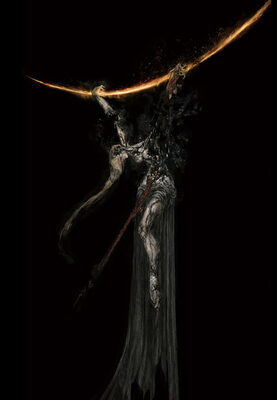

Marika không phải thần từ đầu. Bà xuất thân từ **Shaman Village** trong Land of Shadow, và bà thuộc tộc **Numen**.

Thống trị vùng đất đó là **Hornsent**, một nền văn minh thờ **Crucible** (dạng sự sống nguyên thuỷ, nơi sừng, cánh, rễ còn lẫn lộn trong nhau). Sừng trên đầu họ là dấu hiệu của Crucible.

Người Shaman có một đặc tính khủng khiếp: **thịt của họ hoà lẫn được với thịt kẻ khác**. Hornsent dùng đặc tính đó trong nghi lễ lọ của mình: xẻ thịt những người bị kết án, trộn cùng thịt Shaman, nhồi vào lọ, để "tái sinh" ra cái mà họ gọi là **Jar Saint** (thánh nhân).

Người Shaman bị bắt đi làm nguyên liệu cho nghi lễ đó. Khi Marika quay về, **làng đã trống không**.

 

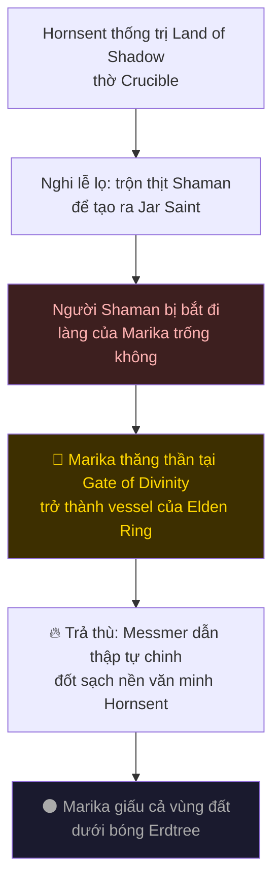

> 💡 **Một cách đọc rất phổ biến, và đáng suy nghĩ:** Golden Order coi **Omen** (Morgott, Mohg) là ô uế vì họ mọc sừng, mà sừng chính là dấu hiệu của Hornsent, kẻ đã huỷ diệt dân tộc Marika. Theo cách đọc này, Marika xích chính con ruột dưới hầm **vì chúng trông giống kẻ thù thời trẻ của bà**.
>
> ⚠️ Đây là **suy luận**, không phải điều game nói ra. Cái DLC cho thấy trực tiếp là bà Hornsent Grandam nguyền rủa dòng dõi Marika. Game không xác nhận Omen sinh ra từ lời nguyền đó.

---

## 3. Messmer the Impaler

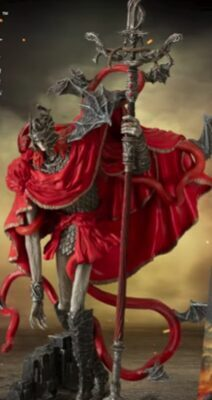

Con trai Marika, người mà game gốc không hề nhắc tới một lần nào.

Trong người ông có **Abyssal Serpent**, một con rắn chực chiếm lấy ông. Marika kìm nó lại bằng cách **móc một mắt ông ra** và đặt vào đó **một con dấu grace**. (Phase 2 của trận đấu chính là lúc con rắn đó chiếm được ông.)

Ông mang một ngọn lửa riêng, thứ lửa đen quấn rắn, và được Marika sai dẫn thập tự chinh vào Land of Shadow **đốt sạch Hornsent**. Ông làm đúng như thế: đóng cọc xuyên người họ dọc đường, đốt trụi thành phố.

Rồi ông ở lại đó cùng cả vùng đất, dưới cái bóng, không bao giờ được gọi về. Ông vẫn ngồi trong toà Shadow Keep, giữ nhiệm vụ mà mẹ đã giao.

> Ông là công cụ trả thù của mẹ, và cũng là bằng chứng mà mẹ phải chôn.

 

---

## 4. Kế hoạch của Miquella

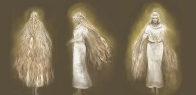

Miquella vào Land of Shadow để tới **Gate of Divinity** ở Enir-Ilim, đúng cái cổng mà Marika đã dùng để thăng thần.

Trên đường đi, hắn **lần lượt vứt bỏ từng phần của chính mình**. Mỗi chỗ hắn bỏ lại một thứ thì mọc lên một **Miquella's Cross** vàng, như dấu chân hắn để lại.

| Hắn vứt bỏ | Ghi chú |
|---|---|
| **Thân xác** (nhiều phần, rải ở nhiều nơi) | Trái tim, cánh tay phải, con mắt... mỗi thứ một chỗ |
| **Sự do dự** | Không còn nghi ngờ chính mình |
| **Nỗi sợ** | Không còn gì cản lại |
| **Tình yêu** | Phần này chính là **St. Trina** |

Cái hắn muốn xây là một kỷ nguyên nhân từ, không còn ai bị ruồng bỏ. Nhưng cách hắn làm là **khiến tất cả mọi người phải yêu hắn**.

Đó là câu hỏi trung tâm của DLC: *một thế giới nhân từ mà trong đó không ai được quyền không đồng ý, thì có còn là nhân từ không?*

 

### 🌸 St. Trina

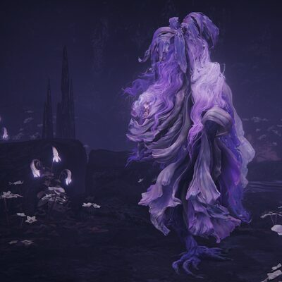

**Nửa còn lại của Miquella**, bị hắn bỏ lại ở **Stone Coffin Fissure**. Tấm cross ở đó ghi rằng thứ hắn bỏ lại chỗ này là **tình yêu**.

Trớ trêu: St. Trina vẫn yêu hắn dù bị vứt bỏ. Và chính vì yêu, cô **cầu xin bạn giết hắn**, vì cô hiểu rằng làm thần là một nhà tù.

Người duy nhất nghe được lời cô là **Thiollier**.

 

### ⭐ Promised Consort Radahn

<table>
<tr>
<td width="50%" align="center">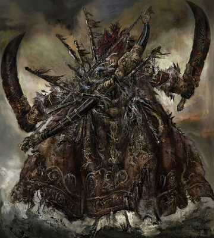 <b>Radahn</b></td>
<td width="50%" align="center">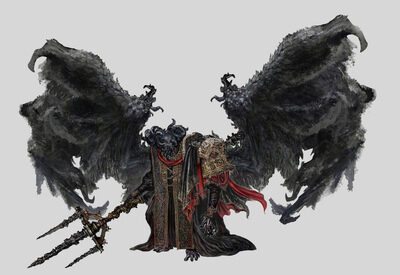 <b>Mohg</b></td>
</tr>
</table>

Thần cần một **consort** đứng cạnh. Miquella đã chọn từ lâu: **Radahn**, người từng có một lời hứa với hắn về chuyện đó.

Nhưng Radahn đã chết ở Caelid, nên cần một cái xác. **Thân xác Mohg trở thành vật chứa cho linh hồn Radahn**, và game xác nhận **Mohg đã bị Miquella mê hoặc**.

Điều này viết lại luôn game gốc: khi bạn giết Mohg, bạn tưởng mình đang cứu Miquella khỏi kẻ bắt cóc. Hoá ra **Mohg cũng là người bị mê hoặc**, và cái xác đó là thứ Miquella cần.

> ⚠️ Nói cho chính xác: game xác nhận Mohg bị mê hoặc và xác hắn được dùng làm vật chứa. Còn chuyện bùa mê **có phải là lý do khiến Mohg đi bắt cóc Miquella ngay từ đầu hay không** thì game không nói thẳng. Quan hệ giữa Miquella và Radahn cũng chỉ được gọi là "promised consort", không mô tả rõ hơn.

---

## 5. ⭐ Metyr - quả bom lore lớn nhất

Ẩn dưới **Cathedral of Manus Metyr**, mở ra qua questline của Ymir.

**Metyr, Mother of Fingers** là **sứ giả đầu tiên** mà Greater Will gửi xuống, ngôi sao đầu tiên rơi xuống Lands Between. Bà sinh ra toàn bộ đám **Two Fingers**, tức là những kẻ đã chỉ đạo Marika, các Empyrean, và cả bạn.

Vấn đề: **Greater Will đã bỏ rơi bà từ rất, rất lâu rồi.** Bà không còn nhận được tín hiệu nào nữa, nhưng vẫn tiếp tục sinh ra những **Fingercreeper** dị dạng.

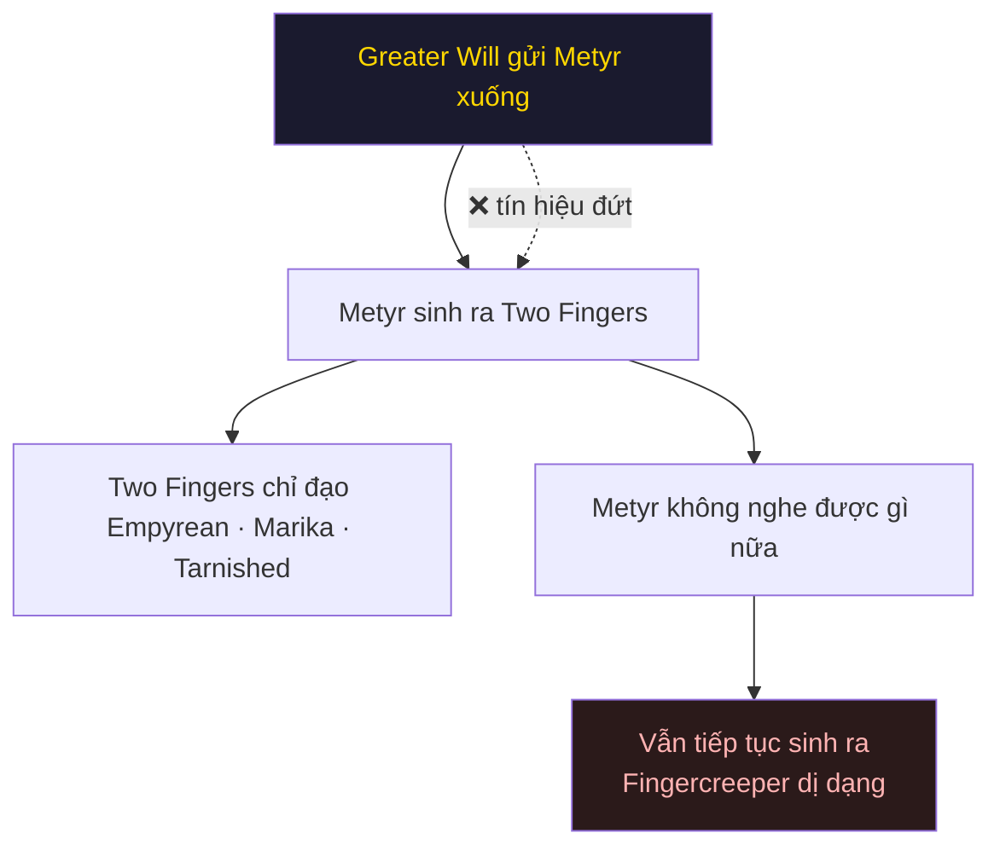

Hệ quả mà người chơi tự rút ra: nếu đầu dây bên kia đã im lặng từ lâu, thì **những mệnh lệnh mà Two Fingers truyền xuống hàng ngàn năm nay dựa trên cái gì?** Game không trả lời câu này, nhưng nó đặt câu hỏi rất rõ.

Điều đó cũng làm lựa chọn của **Ranni** hợp lý hơn nhiều: cô không quay lưng với một vị thần đang cai trị, cô quay lưng với **một đường dây đã đứt**.

---

## 6. Nhóm người quanh Miquella

Ai cũng đi theo Miquella, nhưng vì lý do khác nhau. Điểm mấu chốt: **sức mê hoặc của Miquella tác động lên gần như tất cả bọn họ**, kể cả những người sau này quay lưng.

<table>
<tr>
<td width="130" align="center">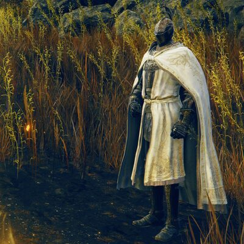 <b>Leda</b></td>
<td><b>Needle Knight</b>, người tập hợp cả nhóm. Cô sùng bái Miquella tuyệt đối. Về cuối cô bắt đầu <b>săn lùng "kẻ phản bội"</b> trong chính nhóm mình, và bạn phải chọn phe. Cô là chân dung rõ nhất của việc bị mê hoặc: cô tin rằng mình đang hoàn toàn tự nguyện.</td>
</tr>
<tr>
<td align="center">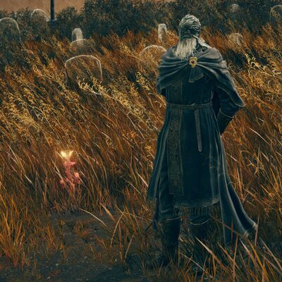 <b>Ansbach</b></td>
<td>Cựu <b>Pureblood Knight</b> của Mohg. Ông đi theo nhóm để <b>điều tra xem Miquella định làm gì</b> và chuyện gì đã xảy ra với chủ cũ của mình. Ông từng cố gỡ bùa mê cho Mohg. Đáng chú ý: chính ông cũng chịu ảnh hưởng của bùa mê, chứ không hoàn toàn miễn nhiễm.</td>
</tr>
<tr>
<td align="center">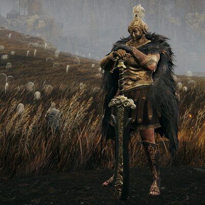 <b>Freyja</b></td>
<td>Hiệp sĩ Redmane. Cô đi theo nhóm dưới ảnh hưởng của bùa mê, nhưng khi bùa tan thì thứ còn lại trong cô vẫn là <b>lòng trung thành với Radahn</b>. Một trong những NPC ấm áp hiếm hoi của DLC.</td>
</tr>
<tr>
<td align="center">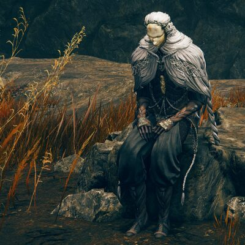 <b>Thiollier</b></td>
<td>Kẻ đi tìm <b>St. Trina</b>, uống thứ nước của cô để nghe được tiếng cô. Anh là người mang thông điệp ngược dòng nhất: rằng bản thân Miquella cũng nên được giải thoát khỏi kế hoạch của chính mình.</td>
</tr>
<tr>
<td align="center">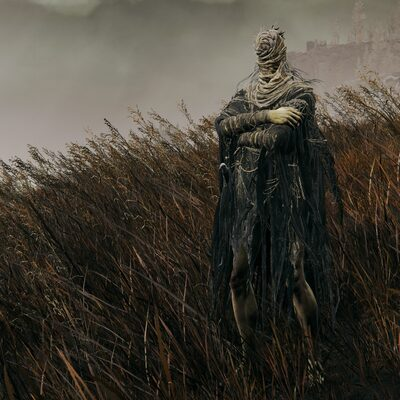 <b>Hornsent</b></td>
<td>Một người Hornsent sống sót sau cuộc thanh trừng của Messmer, sống chỉ để trả thù Marika. Nhưng góc nhìn của anh cũng không sạch: chính dân tộc anh là kẻ đã dựng ra nghi lễ lọ trước.</td>
</tr>
<tr>
<td align="center">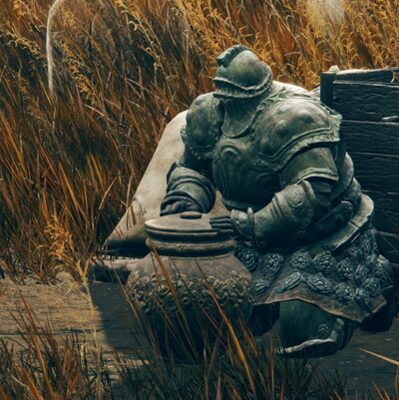 <b>Moore</b></td>
<td>Một <b>Pest</b>, thương nhân của Forager Brood. Đám Pest từng chờ đợi Nữ thần Scarlet Rot, tức Malenia, và <b>bị bà bỏ rơi</b>. Họ theo Miquella thay thế. Câu của ông: <i>"our mother abandoned her brood. She did not love us."</i> Khi ánh sáng Miquella tắt, ông mất nốt chỗ dựa thứ hai.</td>
</tr>
<tr>
<td align="center">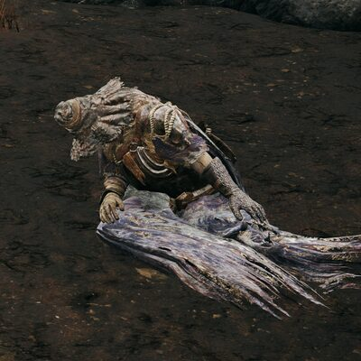 <b>Igon</b></td>
<td>Thợ săn rồng gãy nát cả người, sống chỉ để nguyền rủa con rồng <b>Bayle</b>. Đoạn lồng tiếng của ông lúc được triệu hồi là thứ mà cả cộng đồng Elden Ring thuộc lòng.</td>
</tr>
<tr>
<td align="center">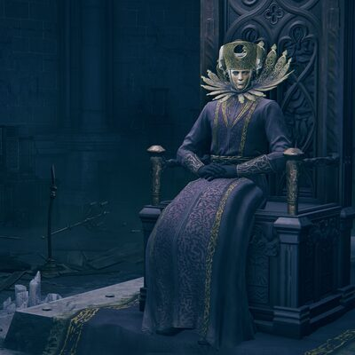 <b>Ymir</b></td>
<td>Chủ Cathedral of Manus Metyr. Ông muốn <b>thay thế Metyr để tự mình trở thành Mother of Fingers mới</b>. Questline của ông dẫn bạn qua Finger Ruins tới chỗ Metyr, và kết thúc bằng việc ông trở mặt.</td>
</tr>
<tr>
<td align="center">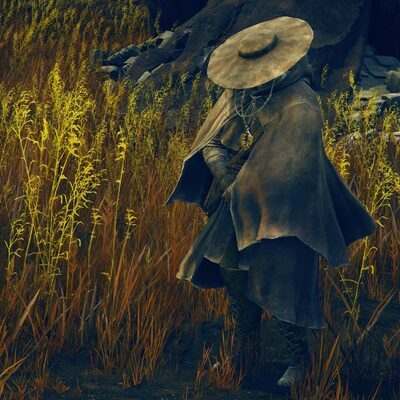 <b>Dryleaf Dane</b></td>
<td>Võ sĩ đánh tay không, đồng minh của Leda trong cuộc thanh trừng cuối.</td>
</tr>
<tr>
<td align="center">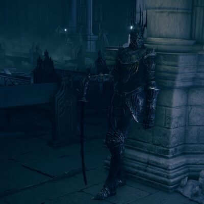 <b>Jolán</b></td>
<td><b>Swordhand of Night</b>, thuộc hạ của Ymir. Cô nằm trong questline của Ymir, không liên quan tới màn chọn phe của Leda.</td>
</tr>
</table>

---

## 7. DLC đổi cách hiểu game gốc như thế nào

| Trong game gốc bạn nghĩ | Sau DLC hoá ra |
|---|---|
| Marika là nạn nhân, bị giam trong Erdtree | Bà từng ra lệnh xoá sổ cả một nền văn minh, rồi giấu vùng đất đó đi |
| Miquella là đứa trẻ thánh thiện bị bắt cóc | Hắn đang tự leo lên ngôi thần, và mê hoặc tất cả những ai đi cùng |
| Bạn cứu Miquella khi giết Mohg | Xác Mohg chính là thứ kế hoạch của Miquella cần |
| Two Fingers truyền lệnh của thần | Đầu dây bên kia đã im lặng từ rất lâu |
| Ranni cực đoan khi bỏ trốn khỏi trật tự | Ranni có lẽ là người nhìn ra sự thật sớm nhất |
| Malenia là bi kịch của riêng cô và em trai | Cả một giống loài đã thờ cô và bị cô bỏ rơi |

---

## Nguồn

- [Miquella - Eldenpedia](https://eldenring.wiki.gg/wiki/Miquella) · [Miquella's Cross](https://eldenring.wiki.gg/wiki/Miquella%27s_Cross)
- [Messmer the Impaler](https://eldenring.wiki.gg/wiki/Messmer_the_Impaler) · [Messmer's Kindling](https://eldenring.wiki.gg/wiki/Messmer%27s_Kindling)
- [Metyr, Mother of Fingers](https://eldenring.wiki.gg/wiki/Metyr,_Mother_of_Fingers) · [Moore](https://eldenring.wiki.gg/wiki/Moore) · [Jolán, Swordhand of Night](https://eldenring.wiki.gg/wiki/Jol%C3%A1n,_Swordhand_of_Night)

Ảnh: concept art và ảnh chụp trong game, FromSoftware / Bandai Namco.
