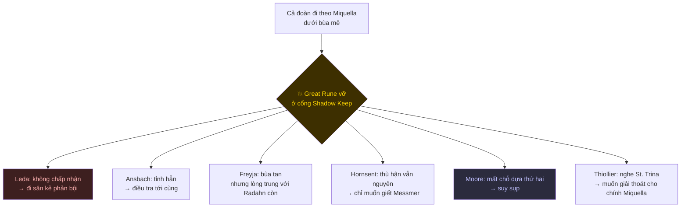

# 🕯️ Questline NPC trong Shadow of the Erdtree

> ⚠️ **Spoiler toàn bộ DLC**, kể cả trận cuối.
>
> File này nói về **các bước và ý nghĩa** của từng questline. Chân dung nhân vật và lore nền
> nằm ở [DLC Shadow of the Erdtree](./05-elden-ring-shadow-of-the-erdtree.md), không lặp lại ở đây.
>
> Muốn danh sách gạch đầu dòng để vừa chơi vừa tick, mở
> [Checklist và lộ trình DLC](../elden-ring-dlc-questline-checklist-va-quest-path.md).

---

## 1. DLC chỉ có một trục duy nhất

Base game có 6 ending, mỗi ending một NPC đại diện, và các questline chạy song song không
liên quan nhau mấy. DLC ngược lại: **gần như mọi NPC đều thuộc cùng một đoàn người**, đoàn
đi theo Miquella vào Land of Shadow. Họ không có ending riêng, DLC cũng không thêm ending nào
cho game gốc.

Cái DLC làm là đặt một câu hỏi rồi bắt từng người trả lời:

> Miquella mê hoặc tất cả những ai đi theo hắn. **Khi bùa tan, mỗi người còn lại cái gì của
> chính mình?**

Và game trả lời câu đó bằng một mốc duy nhất, xảy ra đúng một lần, tự động: **Miquella's Great
Rune vỡ**, khi bạn lần đầu đặt chân tới cổng Shadow Keep. Từ giây phút đó cả đoàn tỉnh ra, và
mỗi người rẽ một hướng.

Leda là người duy nhất **không tỉnh**. Cô tin rằng mình hoàn toàn tự nguyện, và chính niềm tin
đó biến cô thành kẻ đi thanh trừng. Đây là chân dung sắc nhất mà DLC vẽ về sự mê hoặc: nó không
làm bạn đờ đẫn, nó làm bạn **chắc chắn**.

---

## 2. ⚔️ Needle Knight Leda - trục xoay của tất cả

Leda không phải một questline. Cô là **cái khung** mà mọi questline khác treo lên. Cô xuất hiện
ngay ở kén Miquella chỗ Mohg, mời bạn vào Land of Shadow, rồi bám theo suốt.

Sau khi Great Rune vỡ, cô hỏi bạn một câu quyết định cả DLC:

> **"Trong đoàn có kẻ phản bội. Anh nghi ai?"**

Bạn chọn **Thiollier**, **Hornsent**, hoặc **không nói gì**. Cô sẽ đi săn người bị chỉ, và nếu
bạn im lặng thì cô tự chọn Hornsent.

 

Từ đó Leda lần lượt đi giết từng người, mỗi lần là một cuộc invade có dấu triệu hồi. **Bạn phải
chọn phe ngay tại chỗ:**

| Dấu bạn chọn | Nghĩa là |
|---|---|
| 🟡 **Dấu vàng** (Ansbach / Hornsent) | Đứng về phía người bị săn, đánh lại Leda |
| 🔴 **Dấu đỏ** (Leda) | Đứng về phía Leda, người kia chết và questline của họ **hỏng hẳn** |

Ai bị Leda giết thì rơi trọn bộ đồ và **mất luôn phần còn lại của câu chuyện**. Không có cách
cứu về sau.

Trận cuối của cô ở **Cleansing Chamber Anteroom** (Enir-Ilim): Leda cùng Dryleaf Dane, cộng thêm
tối đa ba người nữa tuỳ ai còn sống theo phe cô. Bạn triệu hồi được những người bạn đã cứu.
Đây là lý do phần lớn người chơi thấy trận này khó hoặc dễ hoàn toàn khác nhau: **nó phản ánh
đúng những lựa chọn trước đó của bạn**.

> Điều đáng nói nhất về Leda: cô đúng theo logic của chính mình. Bạn *đúng là* mối đe doạ cho
> việc Miquella thăng thần. Cô nhìn ra điều đó trước cả bạn.

---

## 3. 🗡️ Sir Ansbach - người đi tìm sự thật về chủ cũ

Cựu Pureblood Knight của Mohg. Ông theo đoàn không phải vì tin Miquella, mà để biết **chuyện gì
đã xảy ra với chủ mình**. Chi tiết chua chát: ông từng cố gỡ bùa mê cho Mohg, rồi chính ông dính bùa.

**Các bước:**

1. **Main Gate Cross** - nói chuyện lần đầu, ông giải thích đang lần theo các Miquella's Cross
2. Great Rune vỡ → quay lại nói chuyện, ông nhớ ra mình từng thách thức Miquella
3. **Storehouse, First Floor** (Shadow Keep) - ông đã tìm ra: xác Mohg bị lấy đi
4. Nhặt **Secret Rite Scroll** ở **Storehouse, Fourth Floor** rồi đưa cho ông
5. Ông nhờ chuyển **Letter to Freyja** (làm bước này trước khi đẩy quest Freyja đi tiếp)
6. Nói chuyện cạn với **Leda ở Highroad Cross**, quay lại phòng Ansbach → hai dấu triệu hồi hiện ra,
   **chọn dấu vàng**
7. Enir-Ilim: triệu hồi ông trước trận Leda, rồi triệu hồi lần nữa ở cổng trận cuối

**Kết:** ông chết ở Gate of Divinity sau trận Radahn, để lại `Ansbach's Set`, `Obsidian Lamina`,
`Furious Blade of Ansbach`. Câu cuối ông nói với bạn là ông không oán bạn vì đã giết Mohg, vì
bạn đã giết trong danh dự.

 

---

## 4. 🦁 Redmane Freyja - lòng trung thành còn lại sau khi bùa tan

Freyja là câu trả lời ấm áp nhất cho câu hỏi trung tâm. Bùa mê tan, và thứ còn lại trong cô
không phải Miquella mà là **Radahn**, người chỉ huy cũ.

**Các bước:**

1. **Three-Path Cross** (Gravesite Plain) - nói chuyện cạn
2. Triệu hồi cô ở trận **Divine Beast Dancing Lion**, xong quay lại nói chuyện
3. Great Rune vỡ → nói chuyện lại, cô chuyển tới Shadow Keep
4. Triệu hồi cô ở trận **Golden Hippopotamus**
5. **Storehouse, Seventh Floor** - cô đang cố đọc mấy tấm bia đá. Đưa lá thư của Ansbach
   → nhận `Golden Lion Shield`
6. Báo lại cho Ansbach

**Kết:** cô đứng về phe Leda ở Enir-Ilim và bạn phải đánh cô. Bộ `Freyja's Set` chỉ nhặt được
sau trận đó.

> Chỗ đau của questline này: cô không phản bội bạn. Cô chỉ giữ lời hứa với một người đã chết,
> và người đó bây giờ là cái xác mà Miquella đang dùng.

 

---

## 5. 🐍 Hornsent - kẻ báo thù không sạch tay

Người Hornsent sống sót sau cuộc thanh trừng của Messmer. Anh ghét Erdtree, ghét Tarnished, ghét
cả bạn, và vẫn đi cùng đoàn chỉ vì con đường đó dẫn tới Messmer.

**Các bước:** gặp ở **Three-Path Cross** → anh cho bản đồ đánh dấu các Miquella's Cross → chỉ bạn
tới "cái cây méo mó của bóng tối" → **triệu hồi anh ở trận Messmer**.

**Điểm dễ hỏng:** giết Messmer mà không triệu hồi anh thì anh trở mặt tấn công bạn. Và nếu bạn
chỉ tay vào anh khi Leda hỏi, hoặc im lặng, anh sẽ bị Leda săn.

**Kết:** sau khi Messmer chết, anh không hả hê. Anh tiếc vì cuộc trả thù không phải do chính tay
mình, và nói rằng lưỡi kiếm giờ đã mất lý do tồn tại.

> DLC không cho ai đứng ở phe hoàn toàn đúng. Dân tộc anh chính là kẻ nghĩ ra nghi lễ lọ đã
> nghiền nát dân tộc của Marika. Cuộc thanh trừng của Messmer là tội ác, và nó cũng là quả báo.

 

---

## 6. 🌸 Thiollier - người duy nhất nghe được St. Trina

Thiollier uống thứ nước của St. Trina để nghe được tiếng cô, và vì thế anh mang thông điệp ngược
dòng nhất DLC: **chính Miquella cũng cần được cứu khỏi kế hoạch của mình.**

**Các bước:**

1. **Pillar Path Cross** - gặp anh
2. Xin **Black Syrup** từ **Moore**, đưa cho anh → nhận `Thiollier's Concoction`
3. Xuống **Stone Coffin Fissure** (điểm cực nam Cerulean Coast), hạ **Putrescent Knight**
4. **Garden of Deep Purple** - St. Trina nằm ở góc arena. **Uống nước của cô 6 lần, chia làm 4 lượt
   tới thăm** thì cô mới chịu nói
5. Kể lại lời cô cho Thiollier
6. Anh invade bạn ở chỗ grace → đánh bại rồi nói chuyện → `St. Trina's Smile`
7. Triệu hồi anh ở hai trận cuối

**Điểm dễ hỏng:** tới sát cổng Shadow Keep trước khi làm xong bước 2 là khoá luôn.

 

---

## 7. 🍄 Moore - mất chỗ dựa hai lần

Moore là một Pest thuộc Forager Brood. Giống loài ông từng thờ **Malenia** như nữ thần Scarlet Rot,
và bị bà bỏ rơi. Họ chuyển sang thờ Miquella. Rồi Miquella cũng tắt.

Câu của ông đọng lại nhất DLC: *"our mother abandoned her brood. She did not love us."*

**Các bước:** gặp ở **Main Gate Cross**, mua bán bình thường → Great Rune vỡ → quay lại và
**bạn phải chọn**: cho ông một lời an ủi, hay để ông chìm hẳn trong tuyệt vọng. Kiểu nào rồi
cũng dẫn tới việc phải đánh ông, ở **Church of the Crusade** hoặc **Enir-Ilim**.

**Phần thưởng:** `Moore's Bell Bearing` + bộ `Verdigris` (kể cả greatshield).

Nhánh phụ: gom 6 cuốn **Forager Brood Cookbook** rải khắp Land of Shadow, dùng `Sunwarmth Stone`
ở Church of the Crusade, rồi quay lại ông để lấy cuốn thứ 7.

 

---

## 8. 👐 Count Ymir và Jolán - questline tách rời hoàn toàn

Đây là questline **không dính gì tới đoàn Miquella**, và cũng là questline duy nhất dẫn tới quả
bom lore lớn nhất DLC (mục Metyr trong [file 05](./05-elden-ring-shadow-of-the-erdtree.md)).

**Các bước:**

| # | Nơi | Việc | Nhận |
|---|---|---|---|
| 1 | Cathedral of Manus Metyr | Nói chuyện với Ymir | `Hole-Laden Necklace`, bản đồ 1 |
| 2 | Finger Ruins of Rhia | Rung chuông | `Crimson Seed Talisman +1` |
| 3 | Cathedral | Báo lại | bản đồ 2 |
| 4 | Finger Ruins of Dheo | Rung chuông | `Cerulean Seed Talisman +1` |
| 5 | Cathedral | Báo lại, nghỉ ở grace, kích hoạt ngai của Ymir | `Beloved Stardust`, bản đồ 3 |
| 6 | Finger Ruins of Miyr | Hạ **Swordhand of Night Anna** → `Claws of Night`. Rung chuông → hạ **Metyr** | `Remembrance of the Mother of Fingers` |
| 7 | Cathedral | Kích hoạt ngai lần nữa → hạ **Jolán** rồi hạ **Ymir** | `Maternal Staff`, `High Priest Set`, `Ymir's Bell-Bearing` |

Ymir không muốn phá Two Fingers. Ông muốn **thay thế Metyr để tự làm Mother of Fingers mới**.
Nghĩa là ông không phản kháng cái hệ thống đó, ông chỉ muốn ngồi vào chỗ trống. Đó là điểm
khác nhau giữa ông và Ranni.

 

---

## 9. 🐉 Igon - lời nguyền rủa hay nhất trong game

Igon nát cả người vì **Bayle**, và sống tiếp chỉ để chửi con rồng đó.

**Các bước:** gặp ở **Pillar Path Waypoint** → hạ **Jagged Peak Drake** rồi quay lại nói chuyện cạn
→ lên đỉnh **Jagged Peak**, dấu triệu hồi của ông hiện ra trước cửa sương của **Bayle the Dread**
→ triệu hồi ông.

**Phần thưởng:** `Igon's Greatbow`, `Igon's Harpoon`, bộ giáp và bell bearing của ông, nhặt ở chỗ
con Drake sau khi xong.

Đoạn lồng tiếng của ông lúc được triệu hồi là thứ cả cộng đồng Elden Ring thuộc lòng. Nếu chỉ
làm được một questline phụ trong DLC thì nên làm cái này.

 

---

## 10. 🍲 Hornsent Grandam - bà già trong kho

Bà ngồi trong storeroom ở **Belurat**, mở bằng `Storeroom Key`. Bà nguyền rủa dòng dõi Marika.

**Các bước:** mở kho, nói chuyện → hạ **Divine Beast Dancing Lion** lấy `Divine Beast Head`
→ **đội cái đầu đó lên rồi nói chuyện lại** thì thái độ bà đổi hẳn → nghỉ ở grace, nói chuyện
tiếp → nhận `Scorpion Stew` → hạ **Messmer** → quay lại nhận `Gourmet Scorpion Stew`.

Phần thưởng phép: `Watchful Spirit`. Món Scorpion Stew có thể mang cho Hornsent ở Scadu Altus.

**Điểm dễ hỏng:** vào Shadow Keep quá sớm làm hỏng mạch quest này.

---

## 11. 🍃 Dryleaf Dane - người không nói

Võ sĩ tay không ở **Moorth Ruins**. Thách anh đấu tay đôi (qua `Monk's Missive`) thì anh mở khoá
**Dryleaf Arts** cho bạn.

Giữa DLC, chính anh là người tìm ra Sealing Tree ở Ancient Ruins of Rauh và kết luận rằng chỉ
ngọn lửa của Messmer mới đốt được nó. Rồi anh đứng cạnh Leda ở Enir-Ilim.

Anh im lặng suốt DLC. Câu duy nhất anh nói là lúc gục xuống ở trận cuối: *"Kind Miquella... In
godhood shall you rise."*

 

---

## 12. Trận Enir-Ilim - bảng tổng kết mọi lựa chọn

Trận ở **Cleansing Chamber Anteroom** là chỗ DLC tính sổ. Ai đứng đâu phụ thuộc hoàn toàn vào
những gì bạn đã làm.

| Nhân vật | Đứng phe Leda nếu | Đứng phe bạn nếu |
|---|---|---|
| **Dryleaf Dane** | luôn luôn | không bao giờ |
| **Freyja** | luôn luôn (kể cả khi bạn làm hết quest của cô) | không bao giờ |
| **Hornsent** | bạn chỉ tay vào anh, hoặc bỏ mặc anh cho Leda | bạn chọn dấu vàng cứu anh |
| **Ansbach** | bạn chọn dấu đỏ | bạn chọn dấu vàng |
| **Thiollier** | không | bạn làm xong quest của anh |
| **Moore** | tuỳ nhánh bạn chọn cho ông | không |

Nói cách khác: **bạn không thể cứu tất cả**. Freyja và Dane luôn đứng bên kia, dù bạn có làm
trọn quest của họ hay không. Đó là điểm mà DLC muốn nói: bùa mê của Miquella đủ mạnh để giữ
được cả người đã tỉnh.

---

## 13. Sau trận cuối

DLC **không thêm ending nào** cho game gốc. Sau khi hạ **Promised Consort Radahn**, Miquella bỏ
lại thân xác và biến mất, Ansbach chết ở Gate of Divinity, và bạn quay về Lands Between với
mọi lựa chọn ending cũ còn nguyên.

Cái DLC để lại không phải một kết cục mới, mà là **một cách đọc lại cái cũ**: sau khi thấy
Miquella làm gì với những người yêu quý hắn, bạn nhìn Golden Order và cả sáu ending của game gốc
bằng con mắt khác. Bảng đối chiếu nằm ở mục cuối của
[file 05](./05-elden-ring-shadow-of-the-erdtree.md).

---

## Nguồn

- [Needle Knight Leda](https://eldenring.wiki.gg/wiki/Needle_Knight_Leda) · [Sir Ansbach](https://eldenring.wiki.gg/wiki/Sir_Ansbach) · [Thiollier](https://eldenring.wiki.gg/wiki/Thiollier)
- [Count Ymir](https://eldenring.wiki.gg/wiki/Count_Ymir) · [Moore](https://eldenring.wiki.gg/wiki/Moore) · [Igon](https://eldenring.wiki.gg/wiki/Igon)
- [Hornsent](https://eldenring.wiki.gg/wiki/Hornsent_(NPC)) · [Hornsent Grandam](https://eldenring.wiki.gg/wiki/Hornsent_Grandam) · [Dryleaf Dane](https://eldenring.wiki.gg/wiki/Dryleaf_Dane) · [Freyja's Set](https://eldenring.wiki.gg/wiki/Freyja%27s_Set)
- Trình tự Ansbach/Leda/Freyja: [PowerPyx](https://www.powerpyx.com/elden-ring-shadow-of-the-erdtree-sir-ansbach-leda-freyja-questline-walkthrough/) · [GamesRadar](https://www.gamesradar.com/games/action-rpg/shadow-of-the-erdtree-questlines-npc-quests/)

Ảnh: concept art và ảnh chụp trong game, FromSoftware / Bandai Namco.
